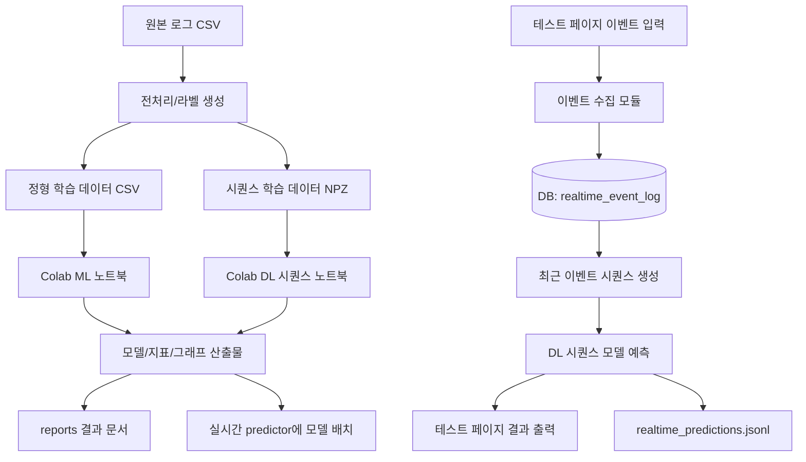

# 프로그램 구조도 · 함수/변수 명세서

가입 고객 이탈 예측 프로젝트의 **코드 구조, 데이터 흐름, 함수·변수 명세**를 정리한 문서입니다.
발표의 "시스템 구조" 슬라이드와 코드 인수인계에 사용합니다. (기준: `src/`, `notebooks/colab/`, `realtime_app/`, `db/`, `configs/`)

---

## 1. 전체 아키텍처 구조도 (파이프라인)

```
  [오프라인 학습 파이프라인]

  data/raw 또는 retail_rees46*/raw
       │
       ▼
  src/preprocess.py 또는 retail_*/prep_*.py
       │
       ├─▶ data/processed/*.csv
       ├─▶ mobile_game_labels/data/{base,A,BC}/tabular.csv
       ├─▶ mobile_game_labels/data/{base,A,BC}/seq.npz
       └─▶ outputs/preprocess_summary.json
              │
              ▼
  notebooks/colab/*.ipynb
  (EDA, 라벨 검증, ML/DL 학습, 하이퍼파라미터 실험)
              │
              ├─▶ models/*.joblib, models/*.pth
              ├─▶ outputs/*_metrics.json
              ├─▶ outputs/*.png
              └─▶ reports/*.md


  [실시간 테스트 페이지 + DB 수집 + DL 시퀀스 예측 파이프라인]

  테스트용 웹 페이지(realtime_app/app.py)
       │  사용자 이벤트 입력/시뮬레이션
       ▼
  realtime_app/event_collector.py
       │
       ├─▶ DB 서버
       │     └─ realtime_event_log 테이블
       │        (user_id, session_id, event_type, item/level, event_time, value_json)
       │
       └─▶ realtime_app/sequence_builder.py
              │  최근 N개 이벤트 로드 + 학습 때와 동일한 정렬/스케일/패딩
              ▼
          realtime_app/predictor.py
              │  models/sequence/*.pth + configs/model_params.yaml
              ▼
          테스트 페이지 출력
          (이탈 확률, 위험 등급, 최근 시퀀스 요약, 추천 대응)
              │
              └─▶ outputs/realtime_predictions.jsonl
```

**핵심 설계 원칙**: 실제 구현은 FastAPI/클린 아키텍처를 무리하게 적용하지 않습니다. 대신 폴더와 함수 책임만 `화면 입력 → 이벤트 저장 → 시퀀스 생성 → 모델 추론 → 결과 출력`으로 분리해, 나중에 API 서버로 바꾸더라도 교체가 쉽도록 유지합니다.

### 1.1 입력/출력 기준 순서도



입력은 크게 두 종류입니다. 첫째, 학습용 원본 로그/전처리 데이터입니다. 둘째, 테스트 페이지에서 실시간으로 들어오는 이벤트입니다. 출력은 학습 산출물(`models/`, `outputs/`, `reports/`)과 실시간 예측 결과(`화면 출력`, `outputs/realtime_predictions.jsonl`)로 나뉩니다.

---

## 2. 폴더 · 모듈 책임

```
team_project_churn/
├── data/
│   ├── raw/              원본 CSV
│   ├── processed/        공통 전처리 결과(train/test, feature table)
│   └── realtime/         테스트 페이지 이벤트 export 백업(선택)
├── notebooks/
│   ├── colab/
│   │   ├── 00_project_overview.ipynb
│   │   ├── 01_rees46_eda_and_label_check.ipynb
│   │   ├── 02_tabular_ml_baseline_colab.ipynb
│   │   ├── 03_sequence_dl_training_colab.ipynb
│   │   ├── 04_mobile_game_replication_colab.ipynb
│   │   └── 05_model_comparison_and_report_colab.ipynb
│   └── colab_outputs/    Colab에서 내려받은 metrics, plots, model card
├── src/
│   ├── preprocess.py    ① 전처리 파이프라인
│   ├── train_ml.py      ② 머신러닝 학습·평가
│   ├── train_dl.py      ③ 딥러닝(MLP) 학습·평가
│   ├── compare.py       ④ 모델 비교·최적 선정
│   ├── predict.py       ⑤ 추론(배포) 예시
│   └── train_advanced.py (보강) 강한 모델·임계값·SMOTE 실험
├── mobile_game_labels/   모바일 게임 라벨 A/B/C 실험 코드·산출물
├── retail_rees46*/       REES46 커머스 로그 실험 코드·산출물
├── realtime_app/         테스트용 실시간 페이지와 시퀀스 예측 모듈(예정)
│   ├── app.py                Streamlit/간단 웹 UI 진입점
│   ├── event_collector.py    화면 입력 이벤트를 DB에 저장
│   ├── sequence_builder.py   DB 이벤트를 모델 입력 시퀀스로 변환
│   ├── predictor.py          DL 모델 로드·예측
│   └── retention_advisor.py  예측 결과 설명/액션 문구 생성(선택)
├── db/                   DB 스키마와 접속 유틸(예정)
│   ├── schema.sql            realtime_event_log 테이블 DDL
│   └── db_client.py          insert/select 함수
├── configs/              파라미터·하이퍼파라미터 설정(예정)
│   ├── model_params.yaml
│   ├── realtime_params.yaml
│   └── db.example.env
├── models/               학습된 모델 + 전처리기 + 시퀀스 모델
├── outputs/              지표(json) · 그래프(png) · 실시간 예측 로그
└── reports/              산출물 문서
```

| 모듈 | 입력 | 출력 | 단일 책임 |
| --- | --- | --- | --- |
| `preprocess.py` | `data/raw/*.csv` | `processed/*.csv`, `preprocessor.joblib`, `preprocess_summary.json` | 정제·인코딩·스케일링·분할 |
| `train_ml.py` | `processed/*.csv` | `models/*.joblib`, `metrics_ml.json`, 그래프 | ML 학습·평가 |
| `train_dl.py` | `processed/*.csv` | `models/mlp.pth`, `metrics_dl.json`, 그래프 | DL 학습·평가 |
| `compare.py` | `metrics_*.json` | `comparison.json/.md` | 비교·최적 선정 |
| `predict.py` | `preprocessor.joblib`+모델 | 콘솔 예측 | 배포 추론 |
| `notebooks/colab/*.ipynb` | 전처리 산출물 | 모델, 지표, 그래프, 리포트 표 | Colab 기반 학습·실험·결과 검증 |
| `db/schema.sql` | 테이블 정의 | `realtime_event_log` | 실시간 이벤트 저장 구조 합의 |
| `db/db_client.py` | DB 접속 정보, 이벤트 dict | insert/select 결과 | DB 입출력 함수 |
| `realtime_app/app.py` | 사용자 입력/시뮬레이션 | 화면 예측 결과 | 테스트용 웹 페이지 |
| `realtime_app/event_collector.py` | 이벤트 payload | DB insert | 실시간 이벤트 수집 |
| `realtime_app/sequence_builder.py` | DB 이벤트 rows | padded sequence tensor | 최근 이벤트를 DL 입력으로 변환 |
| `realtime_app/predictor.py` | sequence tensor, 모델 파일 | churn probability | 실시간 DL 시퀀스 추론 |

### 2.1 Colab 노트북 구성 원칙

Colab은 **모델 학습과 실험 비교 공간**으로 사용합니다. 로컬 코드는 데이터/모델/설정의 기준 저장소이고, Colab은 GPU 학습과 결과 산출을 담당합니다.

| 노트북 | 목적 | 입력 | 주요 출력 |
| --- | --- | --- | --- |
| `00_project_overview.ipynb` | 전체 실험 맵, 데이터/라벨 설명 | reports, summary json | 발표용 구조 표 |
| `01_rees46_eda_and_label_check.ipynb` | REES46 EDA, 라벨 A/B/C 검산 | REES46 processed data | EDA 그림, 라벨 분포 |
| `02_tabular_ml_baseline_colab.ipynb` | LogReg/GBM/MLP 정형 기준선 | `tabular.csv` | ML metrics, feature importance |
| `03_sequence_dl_training_colab.ipynb` | LSTM/Transformer 시퀀스 학습 | `seq.npz`, `split.npz` | `.pth`, DL metrics, loss curve |
| `04_mobile_game_replication_colab.ipynb` | Emre & Cotul 논문 재현/확장 | Mobile Game data | 재현 표, 확장 비교 |
| `05_model_comparison_and_report_colab.ipynb` | 최종 비교표와 발표 그래프 생성 | metrics json | comparison table, png |

Colab에서 생성한 결과는 반드시 로컬의 `models/`, `outputs/`, `reports/`로 다시 내려받아 공유합니다. 노트북만 남기면 재현은 가능하지만, 발표/앱/실시간 테스트 페이지가 바로 쓸 수 있는 산출물이 부족해집니다.

### 2.2 전처리된 데이터 이후 추가 전처리 필요 여부

필요합니다. `data/processed` 또는 각 실험 폴더의 `tabular.csv`, `seq.npz`는 공통 경계 산출물이지만, 모델별 입력 형태가 달라서 추가 변환이 들어갑니다.

| 모델/용도 | 추가 전처리 | 이유 |
| --- | --- | --- |
| LogReg/GBM | 결측 확인, 컬럼 순서 고정, class weight/threshold 설정 | 정형 모델은 2D table이 필요 |
| MLP | float32 변환, label tensor 변환, batch dataset 생성 | PyTorch 입력 형식 필요 |
| LSTM | 유저/세션별 시간 정렬, 최대 길이 `SEQ_MAX_LEN` padding/truncation, mask 생성 | 순서와 길이를 모델이 이해해야 함 |
| Transformer | LSTM 전처리 + position/time-gap feature, attention mask | padding 위치를 attention에서 제외해야 함 |
| 실시간 예측 | DB 최근 이벤트 조회, 학습 때와 동일한 스케일/인코딩, 부족한 시퀀스 padding | 학습/추론 입력 분포를 맞춰야 함 |

즉, 공통 전처리는 "데이터를 깨끗하게 만드는 단계"이고, 모델별 추가 전처리는 "모델이 먹을 수 있는 텐서/테이블로 바꾸는 단계"입니다.

---

## 3. 함수 명세 (파일별 API)

### 3.1 `preprocess.py`
| 함수 | 시그니처 | 반환 | 역할 |
| --- | --- | --- | --- |
| `main()` | `() -> None` | - | 전체 전처리 실행·저장 (아래 흐름) |

처리 흐름: `read_csv` → 식별자 `drop` → 결측/이상치(IQR) 점검 → `train_test_split(stratify=y)` → `ColumnTransformer(StandardScaler + OneHotEncoder)` `fit_transform`(train)/`transform`(test) → CSV·`joblib`·`json` 저장.

### 3.2 `train_ml.py`
| 함수 | 시그니처 | 반환 | 역할 |
| --- | --- | --- | --- |
| `load()` | `() -> (Xtr, ytr, Xte, yte, feat_names)` | 배열·리스트 | 전처리 CSV 로드 |
| `evaluate(name, model, Xte, yte)` | `(str, estimator, ndarray, ndarray)` | `(metrics: dict, proba: ndarray)` | 지표 계산 + 혼동행렬 PNG 저장 |
| `main()` | `() -> None` | - | 3개 ML 모델 학습·평가·저장·ROC·중요도 |

### 3.3 `train_dl.py`
| 객체 | 시그니처 | 역할 |
| --- | --- | --- |
| `class MLP(nn.Module)` | `__init__(in_dim, hidden=(64,32), dropout=0.3)` / `forward(x)->logits` | 다층 퍼셉트론 |
| `main()` | `() -> None` | 텐서 변환→학습(40ep)→평가→`mlp.pth`·지표·그래프 저장 |

### 3.4 `compare.py`
| 함수 | 시그니처 | 반환 | 역할 |
| --- | --- | --- | --- |
| `main()` | `() -> None` | - | `metrics_*.json` 통합→ROC-AUC 최고 모델 선정→비교표 저장 |

### 3.5 `predict.py`
| 함수 | 시그니처 | 반환 | 역할 |
| --- | --- | --- | --- |
| `main()` | `() -> None` | - | `preprocessor.joblib`+최적 모델 로드→신규 고객 이탈 확률 출력 |

### 3.6 `realtime_app/` 예정 모듈
| 파일/함수 | 시그니처 | 반환 | 역할 |
| --- | --- | --- | --- |
| `db_client.get_connection()` | `() -> connection` | DB connection | DB 서버 연결 |
| `db_client.insert_event(payload)` | `(dict) -> int` | `event_id` | `realtime_event_log`에 이벤트 1건 저장 |
| `db_client.select_recent_events(user_id, limit)` | `(str, int) -> list[dict]` | 최근 이벤트 rows | 예측에 필요한 최근 이벤트 조회 |
| `event_collector.validate_event(payload)` | `(dict) -> dict` | 검증된 payload | 필수 필드, 타입, 시간값 검증 |
| `event_collector.save_event(payload)` | `(dict) -> int` | `event_id` | 화면 입력을 DB 저장 함수로 전달 |
| `sequence_builder.build_sequence(events, params)` | `(list[dict], dict) -> tensor/mask` | 모델 입력 | 정렬, 인코딩, padding, mask 생성 |
| `predictor.load_sequence_model(path)` | `(str) -> torch.nn.Module` | 모델 객체 | Colab에서 학습한 `.pth` 로드 |
| `predictor.predict_churn(sequence, mask)` | `(tensor, tensor) -> float` | 이탈 확률 | DL 시퀀스 모델 추론 |
| `retention_advisor.make_message(prob, recent_events)` | `(float, list[dict]) -> dict` | 위험 등급/문구 | 화면에 표시할 설명 생성 |

---

## 4. 주요 변수 명세

### 4.1 전역 설정(상수)
| 변수 | 위치 | 값/타입 | 의미 |
| --- | --- | --- | --- |
| `SEED` | 전 파일 | `42`(int) | 재현성 시드 |
| `TARGET` | preprocess | `"Churn"`(str) | 타깃 컬럼명 |
| `DROP_COLS` | preprocess | `["CustomerId","Surname"]` | 제거 식별자 |
| `CATEGORICAL` | preprocess | `["Geography","Gender"]` | 범주형 컬럼 |
| `THRESHOLD` | predict | `0.5`(float) | 이탈 판정 임계값(운영 시 ↓ 가능) |
| `HERE/RAW/PROC/MODELS/OUT` | 전 파일 | 경로(str) | 디렉터리 기준 경로 |

### 4.2 데이터 핵심 변수
| 변수 | 형태 | 의미 |
| --- | --- | --- |
| `X_train / X_test` | DataFrame/ndarray | 입력 피처 (인코딩·스케일링 후 12개) |
| `y_train / y_test` | Series/ndarray (0/1) | 이탈 라벨 |
| `pre` | `ColumnTransformer` | 학습셋에 fit한 전처리기 |
| `proba` | ndarray(float) | 양성(이탈) 예측 확률 |
| `pred` | ndarray(int) | `proba>=THRESHOLD` 이진 예측 |
| `m / metrics` | dict | accuracy·precision·recall·f1·roc_auc |
| `history`(DL) | list | 에포크별 손실 |

### 4.3 실시간/시퀀스 모델 파라미터 설계

실제 FastAPI 서버를 만들지는 않지만, 설정값은 파일로 분리해 둡니다. 추천 위치는 `configs/model_params.yaml`, `configs/realtime_params.yaml`, `configs/db.example.env`입니다.

#### 공통 실행 파라미터

| 파라미터 | 권장값 | 의미 |
| --- | ---: | --- |
| `SEED` | `42` | 재현성 고정 |
| `TARGET_COL` | `churn` 또는 `label` | 이탈 라벨 컬럼 |
| `POSITIVE_CLASS` | `1` | 이탈 클래스를 1로 고정 |
| `TEST_SIZE` | `0.2` | 로컬 검증 분할 비율 |
| `VALID_SIZE` | `0.2` | Colab 학습 중 검증 비율 |
| `METRIC_PRIMARY` | `roc_auc` | 모델 1차 비교 지표 |
| `METRIC_SECONDARY` | `pr_auc`, `recall` | 불균형/운영 관점 보조 지표 |
| `PRED_THRESHOLD` | `0.5` | 기본 이탈 판정 임계값. 운영 데모에서는 0.35~0.50 튜닝 가능 |

#### 시퀀스 생성 파라미터

| 파라미터 | 권장값 | 의미 |
| --- | ---: | --- |
| `SESSION_GAP_MINUTES` | `30` | 이벤트 간격이 30분 이상이면 새 세션 |
| `SEQ_MAX_LEN_USER` | `50` | 유저 단위 최근 이벤트 최대 길이 |
| `SEQ_MAX_LEN_SESSION` | `30` | 세션 단위 최근 이벤트 최대 길이 |
| `MIN_SEQ_LEN` | `3` | 이보다 짧으면 padding 후 낮은 신뢰도로 표시 |
| `TIME_GAP_CLIP_HOURS` | `72` | 과도한 시간 간격 clipping |
| `PAD_VALUE` | `0` | padding 값 |
| `UNKNOWN_EVENT_ID` | `0` | 학습 때 없던 이벤트 타입 처리 |

#### DL 하이퍼파라미터

| 하이퍼파라미터 | LSTM 권장 | Transformer 권장 | 비고 |
| --- | ---: | ---: | --- |
| `batch_size` | `128` | `128` | Colab GPU 기준 시작점 |
| `epochs` | `30` | `30` | early stopping 사용 |
| `learning_rate` | `1e-3` | `5e-4` | Transformer는 조금 낮게 시작 |
| `weight_decay` | `1e-4` | `1e-4` | 과적합 완화 |
| `embedding_dim` | `16~32` | `32` | event/level embedding |
| `hidden_dim` | `64` | `64` | LSTM hidden 또는 FFN 기준 |
| `num_layers` | `1~2` | `2` | 데이터 크기 대비 과도하게 깊게 만들지 않음 |
| `dropout` | `0.2~0.3` | `0.2~0.3` | 짧은 프로젝트에서는 안정성 우선 |
| `n_heads` | - | `4` | Transformer attention heads |
| `loss` | `BCEWithLogitsLoss` | `BCEWithLogitsLoss` | 불균형이면 `pos_weight` 적용 |
| `optimizer` | `AdamW` | `AdamW` | 기본 최적화기 |
| `early_stopping_patience` | `5` | `5` | 검증 AUC 또는 PR-AUC 기준 |

#### DB/실시간 데모 파라미터

| 파라미터 | 권장값 | 의미 |
| --- | --- | --- |
| `DB_ENGINE` | `postgresql` | DB 서버 기준. 로컬 단독 테스트만 할 경우 SQLite 가능 |
| `DB_TABLE_EVENTS` | `realtime_event_log` | 실시간 유입 이벤트 저장 테이블 |
| `DB_BATCH_INSERT_SIZE` | `1` | 실제 실시간 데모는 즉시 insert |
| `PREDICT_WINDOW_EVENTS` | `50` | 예측 시 최근 이벤트 조회 개수 |
| `PREDICT_REFRESH_SECONDS` | `1` | 테스트 페이지 자동 갱신 주기 |
| `SAVE_REALTIME_LOG` | `true` | 화면 예측 결과를 jsonl로 백업 |

---

## 5. 데이터(산출물) 흐름 명세

| 산출물 | 생성 | 소비 | 내용 |
| --- | --- | --- | --- |
| `data/processed/train.csv`,`test.csv` | preprocess | train_ml, train_dl | 인코딩·스케일링 완료 + Churn |
| `models/preprocessor.joblib` | preprocess | predict | 배포 시 동일 변환 |
| `models/*.joblib`,`mlp.pth` | train_ml/dl | compare, predict | 학습된 모델 |
| `outputs/metrics_ml.json`,`metrics_dl.json` | train_ml/dl | compare | 모델별 지표 |
| `outputs/comparison.json`,`comparison_table.md` | compare | 문서·발표 | 비교표·최적모델 |
| `outputs/*.png` | train_ml/dl | 결과서 | ROC·혼동행렬·중요도·손실 |
| `mobile_game_labels/data/*/seq.npz` | prep_game | Colab DL notebook, realtime predictor 참고 | padding 전/후 시퀀스 학습 데이터 |
| `mobile_game_labels/outputs/game_*_metrics.json` | train_compare/train_reg | reports, comparison notebook | 라벨별 ML/DL 비교 지표 |
| `notebooks/colab/*.ipynb` | 담당자별 Colab 작업 | 팀 전체 | 실험 과정과 재현 코드 |
| `notebooks/colab_outputs/*` | Colab export | reports, 발표 자료 | Colab에서 만든 표/그림/model card |
| `db/schema.sql` | DB 담당 | realtime_app | 실시간 이벤트 테이블 DDL |
| `realtime_event_log` | realtime_app/event_collector | sequence_builder | 실시간 유입 이벤트 원천 테이블 |
| `outputs/realtime_predictions.jsonl` | realtime_app/predictor | reports, 데모 검증 | 예측 시각·유저·확률·위험등급 로그 |

> 경계 산출물(굵게: `processed/*.csv`, `preprocessor.joblib`, `metrics_*.json` 포맷)을 **0일차에 합의**하면 ②③④⑤ 담당이 병렬로 작업할 수 있습니다.

### 5.1 작업별 산출물 공유 방식

| 작업 | 담당 산출물 | 저장 위치 | 공유 방식 |
| --- | --- | --- | --- |
| 데이터/라벨 설계 | processed CSV/NPZ, summary json | `data/processed/`, `mobile_game_labels/data/`, `outputs/` | 파일명과 컬럼 스키마 고정 후 팀 공유 |
| Colab ML 학습 | metrics json, feature importance png | `outputs/`, `notebooks/colab_outputs/` | 노트북 + 결과 파일 둘 다 저장 |
| Colab DL 학습 | `.pth`, metrics json, loss curve | `models/`, `outputs/` | 모델 파일은 용량 확인 후 공유 드라이브/로컬 경로 명시 |
| 비교/리포트 | comparison table, 핵심 그래프 | `reports/`, `outputs/` | 발표 자료에는 `reports` 표를 기준으로 사용 |
| DB 구성 | `schema.sql`, 접속 예시 env | `db/`, `configs/db.example.env` | 비밀번호 없는 예시만 커밋/공유 |
| 실시간 페이지 | 이벤트 입력 화면, 예측 화면 | `realtime_app/` | 실행 명령과 화면 캡처를 보고서에 첨부 |
| 실시간 예측 검증 | `realtime_predictions.jsonl` | `outputs/` | 입력 이벤트와 예측 결과가 맞물리는지 검산 |

### 5.2 실시간 이벤트 테이블 초안

DB 서버에는 최소 1개 테이블을 추가합니다. 목적은 테스트 페이지에서 들어오는 이벤트를 원본 형태로 보존하는 것입니다.

```sql
CREATE TABLE realtime_event_log (
    event_id BIGSERIAL PRIMARY KEY,
    user_id VARCHAR(64) NOT NULL,
    session_id VARCHAR(64),
    event_type VARCHAR(64) NOT NULL,
    item_id VARCHAR(64),
    level_id INTEGER,
    event_value DOUBLE PRECISION,
    event_time TIMESTAMP NOT NULL,
    received_at TIMESTAMP DEFAULT CURRENT_TIMESTAMP,
    value_json JSONB
);
```

이 테이블은 "실시간 원천 로그"입니다. 예측 결과는 화면에 바로 출력하고, 프로젝트 검증용으로는 `outputs/realtime_predictions.jsonl`에 저장합니다. 예측 결과까지 DB에 쌓아야 하는 단계가 오면 `realtime_prediction_log`를 두 번째 테이블로 분리하면 됩니다.

---

## 6. 호출/의존 관계 (Call Graph)

```
preprocess.main
   └─ sklearn: train_test_split, ColumnTransformer(StandardScaler, OneHotEncoder), joblib.dump

train_ml.main
   ├─ load()
   ├─ for model in {LogReg, RF, GBM}: model.fit → evaluate() → joblib.dump
   └─ ROC/feature_importance 저장

train_dl.main
   ├─ MLP(in_dim).forward (학습 루프)
   └─ torch.save(mlp.pth)

compare.main  ─ reads metrics_ml.json + metrics_dl.json ─ argmax(roc_auc)

predict.main  ─ joblib.load(preprocessor, best_model) ─ predict_proba

Colab notebooks
   ├─ load processed/tabular.csv 또는 seq.npz
   ├─ model.fit/train loop
   └─ save models/*.pth + outputs/*_metrics.json + outputs/*.png

realtime_app.app
   ├─ event_collector.insert_event(payload)
   │    └─ db_client.insert("realtime_event_log", payload)
   ├─ sequence_builder.load_recent_events(user_id)
   │    └─ db_client.select_recent(user_id, limit=PREDICT_WINDOW_EVENTS)
   ├─ sequence_builder.transform(events)
   │    └─ padding/mask/scaling
   └─ predictor.predict(sequence_tensor)
        └─ load model_params + models/sequence/*.pth → churn_probability
```

실행 순서:
- 오프라인: `preprocess/labeling → Colab ML/DL 학습 → compare → reports 반영 → models 배치`
- 실시간 데모: `app 실행 → 이벤트 입력 → DB 저장 → 최근 시퀀스 생성 → DL 예측 → 화면/로그 출력`

---

## 7. 코드 컨벤션 / 확장 규칙

- **새 모델 추가** → `train_ml.py`의 `models` 딕셔너리에 한 줄 추가(나머지 자동 평가·저장).
- **새 평가지표** → `evaluate()` 한 곳만 수정 → 전 모델 일괄 반영.
- **데이터 교체**(예: Telco) → `preprocess.py`의 `TARGET/DROP_COLS/CATEGORICAL`만 변경, 하위 단계 그대로 재사용.
- **명명 규칙**: 함수 `snake_case`, 상수 `UPPER_CASE`, 파일=단일 책임 1개.
- **누수 방지 규칙(필수)**: 스케일러·인코더는 **train에만 `fit`**, test/배포는 `transform`만.

---

## 8. (확장) 실시간 테스트 페이지 구조 — FastAPI 없이 구조만 유지

이번 프로젝트에서는 FastAPI나 엄격한 클린 아키텍처를 실제로 적용하지 않습니다. 대신 폴더명과 함수 책임만 아래처럼 나눠서, 발표 때 "운영 구조를 고려했다"는 정도의 설계를 유지합니다.

```
realtime_app/
├── app.py               화면. Streamlit 또는 간단한 로컬 웹 페이지
├── event_collector.py   입력 이벤트 검증 후 DB 저장
├── sequence_builder.py  DB 이벤트를 모델 입력 시퀀스로 변환
├── predictor.py         모델 로드와 이탈 확률 계산
└── retention_advisor.py 위험 등급/추천 액션 문구 생성(선택)

db/
├── schema.sql           realtime_event_log 테이블 정의
└── db_client.py         DB insert/select 함수

configs/
├── model_params.yaml    모델 구조/하이퍼파라미터
├── realtime_params.yaml 실시간 조회 길이/임계값/세션 gap
└── db.example.env       DB 접속 정보 예시. 실제 비밀번호는 저장하지 않음
```

이 구조는 클린 아키텍처 용어로 억지 포장하지 않고도 책임이 분리됩니다.

| 책임 | 실제 파일 | 설명 |
| --- | --- | --- |
| 화면 입력 | `realtime_app/app.py` | 사용자가 이벤트를 보내고 예측 결과를 확인 |
| 이벤트 저장 | `event_collector.py`, `db_client.py` | DB 서버의 `realtime_event_log`에 즉시 저장 |
| 입력 변환 | `sequence_builder.py` | 최근 이벤트를 학습 때와 같은 순서/스케일/패딩으로 변환 |
| 모델 추론 | `predictor.py` | DL 시퀀스 모델을 로드해 이탈 확률 반환 |
| 결과 설명 | `retention_advisor.py` | 위험 등급과 대응 액션을 사람이 읽는 문장으로 변환 |

초기 실행 명령 예시는 다음과 같습니다.

```bash
streamlit run realtime_app/app.py
```

DB 서버가 준비되지 않은 날에는 `realtime_app`이 임시 CSV 또는 SQLite로 동작하게 만들 수 있지만, 최종 구조도와 발표 기준은 DB 서버의 `realtime_event_log` 테이블을 기준으로 설명합니다.
