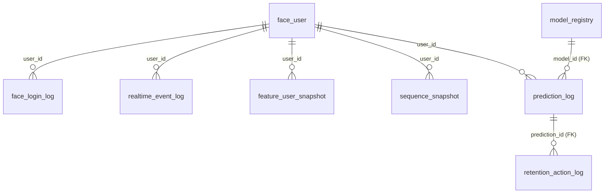

# 프로그램 구조도 · 함수/변수 명세서 v5

REES46 고객 행동 로그를 기준으로 **DB 중심 데이터 흐름 · 로컬 Streamlit 학습/예측 · Vercel 이커머스 시뮬레이션 사이트 · 얼굴 로그인 대시보드 · 실시간 DL 시퀀스 예측**까지 포함한 명세서입니다. 글 포맷은 v2를 유지하고, 내용은 v4 이후 확정된 결정을 반영했습니다.

**v5 주요 변경점**
- 배포 토폴로지 확정: **로컬 Streamlit(torch 학습·예측) + Neon 클라우드 Postgres(공유 DB) + Vercel(이커머스 시뮬 사이트)**.
- 추론은 **로컬 Streamlit에서 torch 네이티브** 수행(서버리스에 PyTorch 번들 X, ONNX 불필요).
- **DB↔파일 용량 경계** 명문화: 원본 2천만 행·시퀀스·모델은 **파일**, Neon에는 **작은 운영 데이터만**.
- **SQL(Postgres)이 우리 케이스에 적합** 근거 추가(조인·집계 위주, NoSQL 불필요).
- **확장 옵션 C: OCI Always Free VM 올인원**(도커는 선택, 나중에) 추가.

---

## 0. 아키텍처 결정 원칙

DB·Vercel·Streamlit·얼굴로그인은 **확정된 요구사항**이다. 단 "형식주의(풀 DDD)"는 만들지 않고 아래 원칙으로 **최소·올바르게** 구축한다.

| 축 | 결정 | 원칙 |
| --- | --- | --- |
| **API / Vercel** | 구축하되 **얇게(Thin)** | API·사이트의 책임 = 전송·DB I/O·인증·시뮬레이션 UI. **ML 추론·전처리 로직은 넣지 않음** |
| **클린아키텍처 수준** | **실용적 L2+** | 폴더·함수로 계층 분리(frontend / services / db_client). `domain/Protocol`·DI 같은 L3 형식계층은 생략. 경계 합의·단일책임만 유지 |
| **인프라** | **DB = 운영 데이터 단일원천, 파일 = 대용량 보조** | 운영 데이터(로그인·이벤트·예측·피처)는 DB. **원본 대용량 로그·시퀀스·모델 바이너리는 파일**(+DB엔 경로/메타) |
| **추론 위치** | **로컬 Streamlit(torch)** | 모델이 작아 연산은 가볍지만 서버리스에 torch 번들이 무거움 → **상시 실행 환경(로컬 Streamlit)에서 추론** |

**불변 규칙**: 스케일러/인코더/이벤트ID 매핑은 **train 구간에서만 fit**, 모든 런타임은 동일 artifact를 **transform만**.

### 0.1 PR / 리뷰 체크리스트
- [ ] API/사이트에 ML·전처리 로직 없음
- [ ] DB URL 등 비밀은 서버 env에만(브라우저/화면 노출 0)
- [ ] 모델 바이너리는 `models/`+`model_registry` 경로(DB 직접 적재 X)
- [ ] 대용량 시퀀스·원본은 파일(npz/parquet/csv)+경로(DB JSONB 지양)
- [ ] 전처리 artifact는 train에만 fit, 그 외 transform만
- [ ] DB 스키마 변경 시 문서·팀 합의 동반

---

## 1. 전체 아키텍처 구조도

프리뷰에서 Mermaid가 안 보이는 문제로 **ASCII 구조도**로 작성합니다.

### 1.1 전체 데이터·학습·서빙 파이프라인

```
[REES46 원본 CSV]
      |
      v
+----------------------------------+
| ingest_rees46.py / build_features|  정제 · 라벨 · 정형피처 · 시퀀스
+----------------+-----------------+
      |                         |
      | (대용량=파일)           | (작은 요약=DB)
      v                         v
 data/processed/*.csv      [Neon] feature_user_snapshot
 outputs/sequences/*.npz          sequence_snapshot(경로)
      |
      v
+-----------------------------------+
| 학습 (로컬 기본 / Colab GPU 선택) |
+----------------+------------------+
train_ml.py · train_dl.py · compare.py
      |                         |
      v (파일)                  v (메타/지표)
 models/*.joblib, *.pth     [Neon] model_registry(경로·metrics)

===================================== 운영(서빙) =====================================

 [Vercel 시뮬 사이트] 고객 행동 -- /api/events --> [Neon] realtime_event_log
                                                        |
                  (로컬 Streamlit이 폴링) <-------------+
                          |
                          v  최근 이벤트 -> 시퀀스 생성 -> torch 예측
                 [로컬 Streamlit predictor] -- prediction_log --> [Neon]
                          |
                          v
                 [대시보드] Neon 조회 -> 이탈확률 · 행동그래프 · 개선안
```

> 위가 **전체 흐름(학습 → 산출물 → 서빙)**, 아래 1.2가 **"무엇이 어디서 실행되는지(배포 위치)"** 다. 둘은 보는 축이 다르다.

### 1.2 배포 토폴로지 (확정안 B)

```
        [Vercel]  이커머스 시뮬레이션 사이트 (Next.js/정적 + 서버리스 API)
            |   고객이 조회/장바구니/구매 시뮬레이션 → 이벤트 발생
            v  (HTTPS, API_SECRET)
   +===================================================+
   |  [Neon]  클라우드 PostgreSQL  (공유 단일 DB)       |
   |   face_user / face_login_log                      |
   |   realtime_event_log                              |
   |   feature_user_snapshot / sequence_snapshot(경로) |
   |   model_registry / prediction_log                 |
   |   retention_action_log                            |
   +===================================================+
            ^   이벤트 읽기 / 예측·피처 쓰기 (DATABASE_URL, SSL, 풀링)
            |
        [로컬 PC]  Streamlit (상시 실행)
          - AI 학습(torch, ML+DL)            ← 무거운 연산은 전부 로컬
          - 최근 이벤트 시퀀스 생성 → DL 예측
          - 얼굴 로그인 + 고객/관리자 대시보드
          - 모델/시퀀스/원본은 로컬 파일에 저장
```

- **로컬 Streamlit** = 학습·실시간 예측·대시보드(연산 담당). Neon에 접속해 이벤트 읽고 예측 결과 씀.
- **Vercel** = 이커머스 시뮬 사이트(고객 행동 발생) → Neon에 이벤트 적재. (Streamlit은 Vercel에 못 올림 → 로컬/Streamlit Cloud)
- **Neon** = 양쪽이 공유하는 운영 DB.

> **추론 위치 주의**: PyTorch 추론은 **로컬 Streamlit**에서 한다. Vercel 서버리스에 torch를 번들하지 않는다(용량·콜드스타트). 굳이 서버리스 추론이 필요하면 ONNX로 전환하지만, 본 구성에서는 불필요.

### 1.3 실시간(시뮬레이션) 예측 흐름

```
[Vercel 시뮬 사이트] 고객 행동 → /api/events → Neon.realtime_event_log 저장
        |
        v  (로컬 Streamlit이 주기적으로 polling)
[로컬 Streamlit]
  - Neon에서 최근 N개 이벤트 조회
  - 학습과 동일 정렬/스케일/패딩으로 시퀀스 생성
  - DL 시퀀스 모델(torch) 예측 → 위험등급 산출
  - Neon.prediction_log 저장 (+retention_action 제안)
        |
        v
[대시보드(로컬 Streamlit / Vercel 사이트)] Neon에서 예측 읽어 표시
  - 실시간 이탈 확률 · 위험 등급 · 행동 그래프 · 개선안
```

> "실시간"은 라이브 트래픽이 아니라 **시뮬레이션 + DB 폴링(수 초 지연)** 임을 발표에서 명시한다. 로컬 Streamlit이 켜져 있어야 예측이 돈다.

### 1.4 입력/출력 기준

| 구분 | 입력 | 처리 | 출력 |
| --- | --- | --- | --- |
| 원본 적재 | REES46 CSV | 정제·라벨·피처 생성 | **파일(csv/parquet)** + 작은 요약은 DB |
| 학습 | 파일 피처/시퀀스 | 로컬(또는 Colab) ML/DL 학습 | 모델 파일 + `model_registry` 메타 |
| 시뮬 이벤트 | Vercel 사이트 행동 | `/api/events`(Thin) | `realtime_event_log`(Neon) |
| 실시간 예측 | 최근 이벤트 시퀀스 | 로컬 Streamlit torch 추론 | `prediction_log`(Neon), 대시보드 |
| 얼굴 로그인 | 얼굴 이미지(클라이언트 캡처) | InsightFace 임베딩 비교 | `face_user`, `face_login_log` |

**운영 원칙**: 팀 공유 기준 = **DB(운영 데이터)**. **원본 로그·시퀀스·모델 = 파일**(+DB 경로). DB는 작게 유지.

---

## 2. 폴더 · 모듈 책임

```
team_project_churn/
├── data/
│   ├── raw/                      REES46 원본 CSV (대용량, 파일 보관)
│   ├── processed/                정제·피처 결과(csv/parquet)
│   └── exports/                  DB에서 내려받은 발표/검증용 샘플
├── db/
│   ├── schema.sql                핵심 테이블 DDL
│   ├── queries.sql               자주 쓰는 조회 쿼리
│   ├── seed_demo_users.sql       데모 사용자/권한 seed
│   └── db_client.py              Python DB 접속/insert/select 공통 함수
├── configs/
│   ├── db.example.env            DB 접속 환경변수 예시
│   ├── model_params.yaml         ML/DL 하이퍼파라미터
│   ├── realtime_params.yaml      실시간 조회/임계값/세션 파라미터
│   └── feature_schema.yaml       feature/sequence 컬럼 스키마
├── notebooks/colab/             (선택) GPU 학습용 노트북 + colab_outputs/
├── src/
│   ├── ingest_rees46.py          REES46 CSV 정제·요약 적재(작은 요약만 DB)
│   ├── build_features.py         피처/시퀀스 파일 생성(+DB 경로 등록)
│   ├── train_ml.py               ML 학습·평가
│   ├── train_dl.py               DL(LSTM/Transformer) 학습·평가
│   ├── compare.py                지표 비교·최적 모델 등록
│   └── predict.py                단건 예측 smoke test
├── frontend_streamlit/          (로컬 실행)
│   ├── app.py                    Streamlit 메인(상시 실행, torch 로드)
│   ├── pages/{01_face_login, 02_customer_dashboard, 03_admin_dashboard}.py
│   └── services/                 ← UI와 분리된 호출 계층(L2+)
│       ├── face_auth.py          InsightFace 얼굴 인증
│       ├── predictor.py          torch 모델 로드·실시간 추론
│       ├── dashboard_service.py  그래프/요약 조회
│       └── db_service.py         Neon 접속 또는 Vercel API 호출
├── vercel_site/                 (Vercel 배포) 이커머스 시뮬레이션 사이트
│   ├── (Next.js/정적 프론트)
│   └── api/{events, predictions/latest, dashboard/summary, auth/login-log}  ← Thin
├── models/{tabular, sequence, preprocessors}   학습 모델·전처리기(파일)
├── outputs/{metrics, plots, sequences, realtime}  지표·그래프·시퀀스(npz)·예측로그
└── reports/
```

| 모듈 | 입력 | 출력 | 책임 |
| --- | --- | --- | --- |
| `ingest_rees46.py` | REES46 CSV | 정제 파일 + DB 요약 | 원본 정제·적재 |
| `build_features.py` | 정제 이벤트 | 피처 파일 + 시퀀스 npz + DB 경로 | 라벨·세션·피처·시퀀스 생성 |
| `train_ml/dl.py` | 피처/시퀀스 파일 | 모델 파일·지표 | 학습·평가 |
| `db/db_client.py` | `DATABASE_URL` | connection/query | 공통 DB 접근 |
| `frontend_streamlit/services/predictor.py` | 최근 이벤트, 모델 파일 | churn probability | 로컬 torch 실시간 추론 |
| `frontend_streamlit/services/face_auth.py` | 얼굴 이미지 | user_id, similarity | InsightFace 인증 |
| `vercel_site/api/*` | HTTP request | JSON | **Thin** 전송·DB I/O·인증·시뮬 |

---

## 3. DB 서버 설계

DB 선택: **기본 Neon(서버리스 Postgres)**, 부가기능 필요 시 Supabase — 근거·비교는 [14 DB 서버 추천](14_DB서버_추천_리스트.md).

### 3.1 무엇을 DB에 / 무엇을 파일에 (용량 경계) ★중요

Neon 무료 한도는 **약 0.5GB 수준**(정책 변동 — 가입 시 확인)이라, **원본 전체를 DB에 넣으면 초과**한다. 따라서 경계를 명확히 한다.

| 데이터 | 크기 | 저장 위치 |
| --- | --- | --- |
| REES46 원본(약 2천만 행) | 수 GB | **파일(csv/parquet)** — 학습은 파일로 |
| 학습 시퀀스(npz) | 큼 | **파일** + `sequence_snapshot`에 경로 |
| 모델 `.pth`/`.joblib`/scaler | 수 MB~ | **파일(`models/`)** + `model_registry` 경로 |
| 로그인·시뮬 이벤트·예측·피처 요약·로그 | 작음(수십~수백 MB) | **DB(Neon)** ✅ |

> "원본까지 전부 DB에 넣고 싶다" → Neon 무료론 불가. 그땐 **OCI 자가호스팅 Postgres(블록스토리지 ~200GB)** 로(11장 옵션 C).

### 3.2 SQL(Postgres) vs NoSQL — 우리 케이스 판단

- 우리 워크로드는 **조인·집계 위주**(이벤트↔유저↔예측↔액션 조인, 퍼널·이탈률 집계)이고 **스키마가 명확**하며 **규모가 데모 수준(초당 몇 건)** 이다 → **SQL이 더 적합**.
- "실시간 로그 = NoSQL"은 **웹스케일(초당 수만+)·가변 스키마**일 때만 해당. 우리는 아님.
- 가변 필드는 **JSONB 컬럼**(`value_json`, `feature_json`, `top_factors_json`)으로 충분(Postgres가 관계형+문서형 하이브리드).
- → **Neon/Postgres가 충분을 넘어 정답.** NoSQL 도입은 복잡도만 늘린다.

### 3.3 DB 중심 원칙

| 원칙 | 설명 |
| --- | --- |
| 운영 데이터는 DB에 | 로그인·시뮬 이벤트·예측·피처 요약을 Neon에 |
| 대용량은 파일에 | 원본·시퀀스·모델 바이너리는 파일, DB엔 경로/메타 |
| 학습은 파일 기준 | 로컬/Colab 학습은 파일 피처/시퀀스로 |
| 프론트는 DB/API 경유 | Streamlit/사이트는 Neon 직접 또는 Thin API로 조회 |
| 민감정보 분리/암호화 | 얼굴 임베딩·로그인 로그는 별도 테이블·권한 |

### 3.4 핵심 테이블 초안

```sql
CREATE TABLE realtime_event_log (
    event_id BIGSERIAL PRIMARY KEY,
    user_id VARCHAR(64) NOT NULL,
    session_id VARCHAR(128),
    event_type VARCHAR(32) NOT NULL,
    product_id VARCHAR(64),
    category_code TEXT,
    price NUMERIC(12, 2),
    event_time TIMESTAMPTZ NOT NULL,
    source VARCHAR(32) DEFAULT 'vercel_sim',
    value_json JSONB,
    received_at TIMESTAMPTZ DEFAULT CURRENT_TIMESTAMP
);

CREATE TABLE feature_user_snapshot (
    snapshot_id BIGSERIAL PRIMARY KEY,
    user_id VARCHAR(64) NOT NULL,
    snapshot_time TIMESTAMPTZ NOT NULL,
    recency_hours DOUBLE PRECISION,
    view_count INTEGER, cart_count INTEGER, purchase_count INTEGER,
    session_count INTEGER, sequence_len INTEGER,
    label INTEGER, feature_json JSONB,
    created_at TIMESTAMPTZ DEFAULT CURRENT_TIMESTAMP
);

-- 시퀀스 원본은 파일(npz/parquet), DB엔 경로/메타만
CREATE TABLE sequence_snapshot (
    snapshot_id BIGSERIAL PRIMARY KEY,
    user_id VARCHAR(64) NOT NULL,
    snapshot_time TIMESTAMPTZ NOT NULL,
    seq_len INTEGER NOT NULL,
    n_features INTEGER NOT NULL,
    storage_format VARCHAR(16) DEFAULT 'npz',
    artifact_path TEXT NOT NULL,
    row_index INTEGER,
    label INTEGER,
    created_at TIMESTAMPTZ DEFAULT CURRENT_TIMESTAMP
);

CREATE TABLE model_registry (
    model_id BIGSERIAL PRIMARY KEY,
    model_name VARCHAR(128) NOT NULL,
    model_type VARCHAR(64) NOT NULL,
    artifact_path TEXT NOT NULL,         -- 모델 파일 경로(파일은 DB 밖)
    feature_schema_version VARCHAR(32),
    metrics_json JSONB,
    is_active BOOLEAN DEFAULT FALSE,
    created_at TIMESTAMPTZ DEFAULT CURRENT_TIMESTAMP
);

CREATE TABLE prediction_log (
    prediction_id BIGSERIAL PRIMARY KEY,
    model_id BIGINT REFERENCES model_registry(model_id),
    user_id VARCHAR(64) NOT NULL,
    session_id VARCHAR(128),
    churn_probability DOUBLE PRECISION NOT NULL,
    risk_level VARCHAR(16) NOT NULL,
    top_factors_json JSONB,
    recommended_action TEXT,
    created_at TIMESTAMPTZ DEFAULT CURRENT_TIMESTAMP
);

CREATE TABLE face_user (
    user_id VARCHAR(64) PRIMARY KEY,
    display_name VARCHAR(100),
    role VARCHAR(32) DEFAULT 'customer',
    face_embedding_encrypted BYTEA,
    face_threshold DOUBLE PRECISION DEFAULT 0.45,
    is_active BOOLEAN DEFAULT TRUE,
    created_at TIMESTAMPTZ DEFAULT CURRENT_TIMESTAMP,
    updated_at TIMESTAMPTZ DEFAULT CURRENT_TIMESTAMP
);

CREATE TABLE face_login_log (
    login_id BIGSERIAL PRIMARY KEY,
    user_id VARCHAR(64),
    success BOOLEAN NOT NULL,
    similarity DOUBLE PRECISION,
    failure_reason TEXT,
    login_at TIMESTAMPTZ DEFAULT CURRENT_TIMESTAMP
);

CREATE TABLE retention_action_log (
    action_id BIGSERIAL PRIMARY KEY,
    prediction_id BIGINT REFERENCES prediction_log(prediction_id),
    user_id VARCHAR(64) NOT NULL,
    action_type VARCHAR(64),
    action_message TEXT,
    status VARCHAR(32) DEFAULT 'suggested',
    created_at TIMESTAMPTZ DEFAULT CURRENT_TIMESTAMP
);
```

> 참고: `raw_rees46_events`(원본 전체)는 **DB에 적재하지 않음**(파일). 데모용 일부 샘플만 필요 시 `realtime_event_log`/별도 샘플 테이블로.

### 3.5 ERD (개체 관계도)

`face_user.user_id`가 **고객/관리자 식별의 기준**이고, 대부분 테이블은 `user_id`로 그 고객을 가리킨다. 강제 FK는 `prediction_log.model_id → model_registry`, `retention_action_log.prediction_id → prediction_log` 두 개이고, `user_id`는 **논리적 참조**(시뮬 이벤트가 아직 face_user에 없는 유저로 들어올 수 있어 소프트 참조)이다.

```
                          +------------------------------+
                          |  model_registry              |
                          |  PK model_id                 |
                          |     model_name               |
                          |     artifact_path  --> 파일  |
                          |     metrics_json / is_active |
                          +-------------+----------------+
                                        | 1
                                        | model_id (FK)
                                        v N
 +-------------------+     +----------------------------+     +--------------------------+
 |  face_user        |1   N|  prediction_log            |1   N|  retention_action_log    |
 |  PK user_id       |----<|  PK prediction_id          |----<|  PK action_id            |
 |     display_name  |     |     user_id   (논리참조)   |     |     prediction_id (FK)   |
 |     role          |     |     model_id  (FK)         |     |     user_id              |
 |     face_embed_enc|     |     churn_probability      |     |     action_type/message  |
 |     face_threshold|     |     risk_level             |     |     status               |
 +----+----+----+----+     +----------------------------+     +--------------------------+
      |1   |1   |1   |1__________________________________
      |    |    |                                        \  (user_id 논리참조, 1:N)
      |N   |N   |N                                        N
 +--------------+ +--------------------+ +----------------------+ +----------------------+
 |face_login_log| |realtime_event_log  | |feature_user_snapshot | |sequence_snapshot     |
 |PK login_id   | |PK event_id         | |PK snapshot_id        | |PK snapshot_id        |
 |   user_id    | |   user_id          | |   user_id            | |   user_id            |
 |   success    | |   event_type       | |   recency/counts...  | |   artifact_path -->파일|
 |   similarity | |   event_time       | |   feature_json/label | |   seq_len/label      |
 +--------------+ +--------------------+ +----------------------+ +----------------------+

 표기:  ----<  = 1:N (왼쪽 1, 오른쪽 N / crow's foot)   ;  --> 파일 = DB 밖 파일 참조
```

**관계 요약**

| 부모(1) | 자식(N) | 키 | FK 강제 |
| --- | --- | --- | --- |
| `face_user` | `face_login_log` | user_id | 논리(소프트) |
| `face_user` | `realtime_event_log` | user_id | 논리 |
| `face_user` | `feature_user_snapshot` | user_id | 논리 |
| `face_user` | `sequence_snapshot` | user_id | 논리 |
| `face_user` | `prediction_log` | user_id | 논리 |
| `model_registry` | `prediction_log` | model_id | **FK** |
| `prediction_log` | `retention_action_log` | prediction_id | **FK** |

> **파일 참조**: `sequence_snapshot.artifact_path`, `model_registry.artifact_path`는 DB 밖 **파일(npz/pth 등)** 을 가리킨다(용량 경계 3.1).

<details><summary>Mermaid ERD (지원 뷰어용 — GitHub 등)</summary>


</details>

### 3.6 DB 연결 방식 (풀링·SSL 필수)

| 연결 주체 | 방식 | 비고 |
| --- | --- | --- |
| 로컬 Streamlit | `.env`의 `DATABASE_URL` 직접 접속 | 학습/예측/대시보드, **풀링 URL + SSL** |
| Vercel 사이트/API | 서버리스 함수에서 접속 | **풀링 엔드포인트**(서버리스 커넥션 폭주 방지), env에 비밀 |
| (확장) Colab | `DATABASE_URL` 접속 | GPU 학습 시 |

---

## 4. 학습 환경 (로컬 기본, Colab 선택)

추론·대시보드는 로컬 Streamlit이 담당하고, **학습도 로컬이 기본**이다. 더 큰 모델·GPU가 필요하면 Colab을 보조로 쓴다.

| 단계 | 환경 | 입력 | 산출물 |
| --- | --- | --- | --- |
| EDA/라벨 검증 | 로컬/Colab | 정제 파일 | 그래프·분포 |
| 피처/시퀀스 생성 | 로컬 | 정제 이벤트 | 피처 파일 + 시퀀스 npz(+DB 경로) |
| ML 학습 | 로컬(또는 Colab) | 피처 파일 | `.joblib`, metrics |
| DL 학습 | 로컬/Colab(GPU) | 시퀀스 npz | `.pth`, metrics, loss curve |
| 비교/등록 | 로컬 | metrics | `model_registry` 등록(경로/지표) |

공유 순서: `outputs/metrics·plots 저장 → models/ 저장 → model_registry 등록 → reports 표 반영`.

---

## 5. 모델별 추가 전처리

DB/파일이 기준이어도 모델별 입력 형태가 달라 추가 변환이 필요하다.

| 모델/화면 | 추가 전처리 | 이유 |
| --- | --- | --- |
| LogReg/GBM/LightGBM | 결측 처리, 컬럼 순서 고정, train 기준 scaler/encoder | 2D 정형 테이블 |
| XGBoost | class weight / scale_pos_weight | 불균형 대응 |
| MLP | float32, tensor dataset | PyTorch 입력 |
| LSTM | 시간순 정렬, `SEQ_MAX_LEN` 자르기/패딩, mask | 시퀀스 길이 통일 |
| Transformer | + position/time-gap feature, attention mask | padding 위치 제외 |
| 실시간 예측(로컬) | Neon 최근 이벤트 → 학습과 동일 변환 | feature drift 방지 |
| 대시보드 그래프 | 시간 집계, 위험등급 bucket, 최근 예측 join | 요약 생성 |

**불변 규칙(0장 재확인)**: 스케일러/인코더/이벤트ID 매핑은 train에서만 fit, 그 외 transform만.

---

## 6. Streamlit 얼굴 로그인 & 대시보드 (로컬 실행)

`opencv_face_login` 참고: `InsightFace FaceAnalysis("buffalo_l")`, 512차원 임베딩, 코사인 유사도, 임계값 `0.45`.

### 6.1 얼굴 로그인 흐름
```
[등록] ID 입력 → 중복 DB 조회 → 얼굴 검출 → 가장 큰 얼굴 → 512d 임베딩 → L2 정규화 → 암호화 후 face_user 저장
[로그인] 얼굴 검출 → 임베딩 정규화 → face_user 후보와 코사인 유사도 → ≥ threshold 성공 → face_login_log 저장 → role 분기
```

### 6.2 고객 대시보드
| 영역 | 내용 | 출처 |
| --- | --- | --- |
| 내 이탈 위험 | 이탈 확률·위험 등급 | `prediction_log` |
| 최근 행동 그래프 | view/cart/purchase 시계열·세션 길이 | `realtime_event_log` |
| 실시간 이탈률 | 최근 예측 기준 위험 고객 비율 | `prediction_log` |
| 개선안 제시 | 쿠폰·장바구니 리마인드·추천·재방문 알림 | `retention_action_log` |
| 최근 추천 이력 | 추천 액션과 상태 | `retention_action_log` |

### 6.3 관리자 대시보드
전체 위험 비율 · 위험등급 분포 · 이벤트 퍼널(view→cart→purchase) · 모델 성능(active, AUC/PR-AUC/Recall) · 실시간 로그 · 액션 관리.

### 6.4 환경 주의 (로컬 vs 서버)
- **로컬 실행**: 노트북 웹캠 직접 사용 가능. Windows 설치 시 `insightface`가 **VS Build Tools(C++)** 요구.
- **(확장) 리눅스/도커**: VS Build Tools 대신 **`build-essential` + `cmake`**. 헤드리스 서버엔 카메라 없음 → **얼굴 캡처는 브라우저(클라이언트)에서, 서버는 이미지 받아 임베딩만**. ARM(A1)은 onnxruntime/insightface 휠 이슈 가능.

### 6.5 `opencv_face_login` README 개선 과제 반영
| 개선 항목 | 반영 |
| --- | --- |
| 로그인 성공/실패 로그 DB 저장 | `face_login_log` |
| 등록 시 ID 중복 확인 | `face_user` PK 조회 |
| 관리자만 예측 접근 | `face_user.role` 분기 |
| 이탈 예측 결과 DB 저장 | `prediction_log` |
| 고위험 고객 자동 추천 | `retention_action_log` |
| 실제 데이터 학습 | REES46 |
| 여러 모델 비교 | GBM/LightGBM/XGBoost/LSTM/Transformer |
| 임베딩 암호화 | `face_embedding_encrypted` |
| HTTPS/2FA/실패제한/위조방어 | Vercel HTTPS, 비번+얼굴 2FA, 실패 제한, liveness 후보 |
| 라이선스/동의 | 생체정보 동의 문구 + InsightFace 라이선스 확인 |

---

## 7. Vercel 이커머스 시뮬레이션 사이트 & Thin API

Streamlit은 상시 실행 앱이라 Vercel 서버리스와 궁합이 나쁘다. 따라서 **Vercel에는 Streamlit이 아니라 "이커머스 시뮬레이션 사이트(Next.js/정적)"** 를 올린다. 추론은 로컬 Streamlit에서 한다.

**역할**: 고객이 사이트에서 상품 조회·장바구니·구매를 **시뮬레이션** → 이벤트가 Thin API로 Neon에 저장 → 로컬 Streamlit이 폴링해 예측.

### 7.1 API 엔드포인트 (Thin)
| Endpoint | Method | 입력 | 출력 | 책임 |
| --- | --- | --- | --- | --- |
| `/api/events` | POST | 이벤트 payload | `event_id` | `realtime_event_log` 저장 |
| `/api/events/recent` | GET | `user_id`,`limit` | 최근 이벤트 | 조회 |
| `/api/predictions/latest` | GET | `user_id` | 최신 예측 | 대시보드 표시 |
| `/api/dashboard/summary` | GET | 기간/권한 | 집계 | 관리자 요약 |
| `/api/auth/login-log` | POST | 로그인 결과 | `login_id` | 얼굴 로그인 로그 |

### 7.2 Vercel 환경변수
`DATABASE_URL`(풀링), `DB_SSL`, `API_SECRET`, `PRED_THRESHOLD_LOW/HIGH`.

> **추론은 Vercel에서 하지 않는다.** torch는 로컬 Streamlit에만. (서버리스 추론이 꼭 필요해지면 ONNX 변환으로 분리)

---

## 8. 파라미터와 하이퍼파라미터

### 8.1 공통
| 파라미터 | 권장값 | 의미 |
| --- | ---: | --- |
| `SEED` | `42` | 재현성 |
| `SOURCE_DATASET` | `REES46` | 최종 데이터 소스 |
| `POSITIVE_CLASS` | `1` | 이탈 라벨 |
| `TRAIN_SPLIT_MODE` | `temporal` | 시계열 누수 방지 |
| `METRIC_PRIMARY` | `roc_auc` | 1차 지표 |
| `METRIC_SECONDARY` | `pr_auc, recall, f1` | 보조 지표 |
| `PRED_THRESHOLD` | `0.5` | 기본 이탈 판정 |
| `HIGH_RISK_THRESHOLD` | `0.7` | 대시보드 고위험 |

### 8.2 시퀀스
| 파라미터 | 권장값 | 의미 |
| --- | ---: | --- |
| `SESSION_GAP_MINUTES` | `30` | 세션 분리 |
| `SEQ_MAX_LEN_USER` | `50` | 유저 최근 이벤트 길이 |
| `SEQ_MAX_LEN_SESSION` | `30` | 세션 이벤트 길이 |
| `MIN_SEQ_LEN` | `3` | 최소 예측 신뢰 길이 |
| `TIME_GAP_CLIP_HOURS` | `72` | 시간 간격 clipping |
| `EVENT_TYPES` | `view, cart, purchase` | 이벤트 타입 |
| `PAD_VALUE` | `0` | padding 값 |

### 8.3 DL 하이퍼파라미터
| | LSTM | Transformer | 비고 |
| --- | ---: | ---: | --- |
| batch_size | 128 | 128 | |
| epochs | 30 | 30 | early stopping |
| learning_rate | 1e-3 | 5e-4 | Transformer 낮게 |
| weight_decay | 1e-4 | 1e-4 | 과적합 완화 |
| embedding_dim | 32 | 32 | |
| hidden_dim | 64 | 64 | |
| num_layers | 1~2 | 2 | |
| dropout | 0.2~0.3 | 0.2~0.3 | |
| n_heads | - | 4 | attention heads |
| loss | BCEWithLogitsLoss(+pos_weight) | 동일 | 불균형 대응 |
| optimizer | AdamW | AdamW | |
| early_stopping_patience | 5 | 5 | 검증 AUC 기준 |

### 8.4 얼굴 로그인
| 파라미터 | 권장값 | 의미 |
| --- | ---: | --- |
| `FACE_MODEL_NAME` | `buffalo_l` | InsightFace 모델팩 |
| `FACE_DET_SIZE` | `(640, 640)` | 검출 입력 크기 |
| `FACE_SIM_THRESHOLD` | `0.45` | 코사인 유사도 임계값 |
| `MAX_LOGIN_FAILS` | `5` | 실패 제한 |
| `FACE_EMBEDDING_DIM` | `512` | 임베딩 차원 |

---

## 9. 산출물 공유 방식

| 작업 | 산출물 | 위치 | 공유 기준 |
| --- | --- | --- | --- |
| 원본 정제 | 정제 파일·요약 | 파일 + DB 요약 | 행 수/기간 검증 |
| 라벨/피처 | 피처 파일 + 시퀀스 npz | 파일 + DB 경로 | 스키마·라벨 분포 |
| ML 학습 | model, metrics, 중요도 | `models/tabular/`, `model_registry` | 지표 json + 경로 |
| DL 학습 | `.pth`, metrics, loss curve | `models/sequence/`, `model_registry` | active 여부 |
| 실시간 예측 | prediction rows | `prediction_log`(Neon) | 화면=DB 일치 검산 |
| 얼굴 로그인 | login rows | `face_login_log`(Neon) | 성공/실패/유사도 |
| 발표 문서 | 구조도·결과표·스크린샷 | `reports/`, `outputs/plots/` | 보고서 기준 |

---

## 10. 실행 순서

```
1. Neon DB 생성 → db/schema.sql 실행
2. REES46 정제 → 파일 피처/시퀀스 생성(+DB 경로 등록)
3. 로컬(또는 Colab)에서 ML/DL 학습 → 모델 파일 저장 + model_registry 등록
4. 로컬 Streamlit 실행(torch 모델 로드) → 얼굴 로그인
5. Vercel 시뮬 사이트 배포 → 고객 행동 시뮬레이션 → /api/events → Neon 저장
6. 로컬 Streamlit이 Neon 폴링 → 시퀀스 생성 → torch 예측 → prediction_log 저장
7. 고객/관리자 대시보드에서 이탈확률·그래프·개선안 확인
```

---

## 11. 배포 옵션 비교

| 옵션 | 구성 | 추론 | 장점 | 단점 |
| --- | --- | --- | --- | --- |
| A. 전부 Vercel | Next.js + ONNX 서버리스 + Neon | ONNX 서버리스 | 단일 배포 | Streamlit·torch 못 씀, 프론트 재작성 |
| **B. 현재 확정** | **로컬 Streamlit + Neon + Vercel 시뮬사이트** | **로컬 torch** | 배포 쉬움, torch 네이티브, ONNX 불필요 | 예측은 로컬 켜야 함, DB 폴링 지연 |
| C. OCI 올인원(확장) | **OCI A1 VM(24GB)** 에 Postgres+Streamlit+사이트 | VM torch | 상시 실행(노트북 불필요), 200GB로 원본까지 DB 가능 | 서버 관리 부담, A1 용량 확보·회수 리스크, GPU 없음 |

- **C 메모(나중 확장)**: 무료 **Autonomous DB는 Oracle DB**라 안 쓰고 **VM에 Postgres 직접 설치**. **도커는 선택**(여유 시 `docker-compose`로 포장해 재배포). 얼굴로그인은 `build-essential/cmake`, 카메라는 클라이언트 캡처.

---

## 12. 주의사항
- REES46 최종 소스(게임 데이터 제외).
- **원본 2천만 행·시퀀스·모델은 파일**, Neon엔 **작은 운영 데이터만**(무료 한도).
- 모델 바이너리는 DB에 직접 적재 X(파일+경로).
- DB 비밀번호는 **서버 env에만**(브라우저/화면 노출 금지), **풀링 URL + SSL**.
- "실시간"은 **시뮬레이션 + DB 폴링(수 초 지연)**, 로컬 Streamlit 상시 실행 전제.
- 얼굴 임베딩은 생체정보 → 원본 이미지 저장 최소화, **암호화 저장**.
- 범위: 본 v5는 **확장 비전**. 6/23 제출 핵심(전처리·학습 결과서·모델)은 오프라인 파이프라인([05-0])으로 먼저 확정 권장.

---

## 13. 시각화 자료 이미지

아래 PNG 파일들은 문서 프리뷰와 발표 슬라이드에서 바로 사용할 수 있도록 별도 이미지로 생성했다. 원본 위치는 `reports/assets/05-5/`이고, 동일 파일을 `outputs/plots/architecture/`에도 복사해 두었다.

### 13.1 시각화 자료 인덱스


### 13.2 전체 데이터·학습·서빙 파이프라인


### 13.3 배포 토폴로지 확정안 B


### 13.4 실시간 시뮬레이션 예측 흐름


### 13.5 DB와 파일 저장 경계


### 13.6 핵심 DB ERD


### 13.7 Streamlit 얼굴 로그인 및 고객 대시보드 와이어프레임


