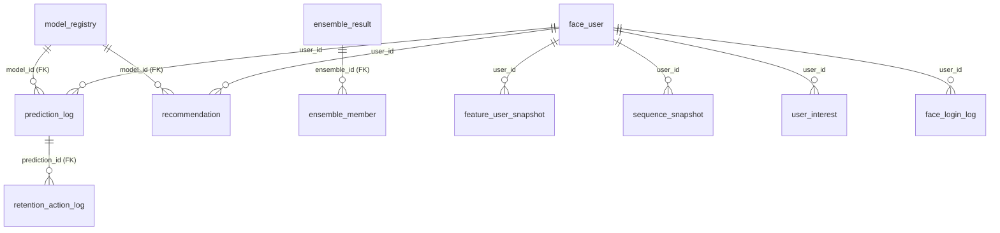
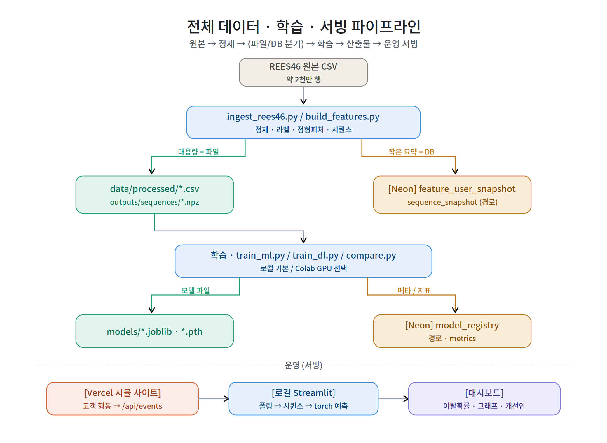
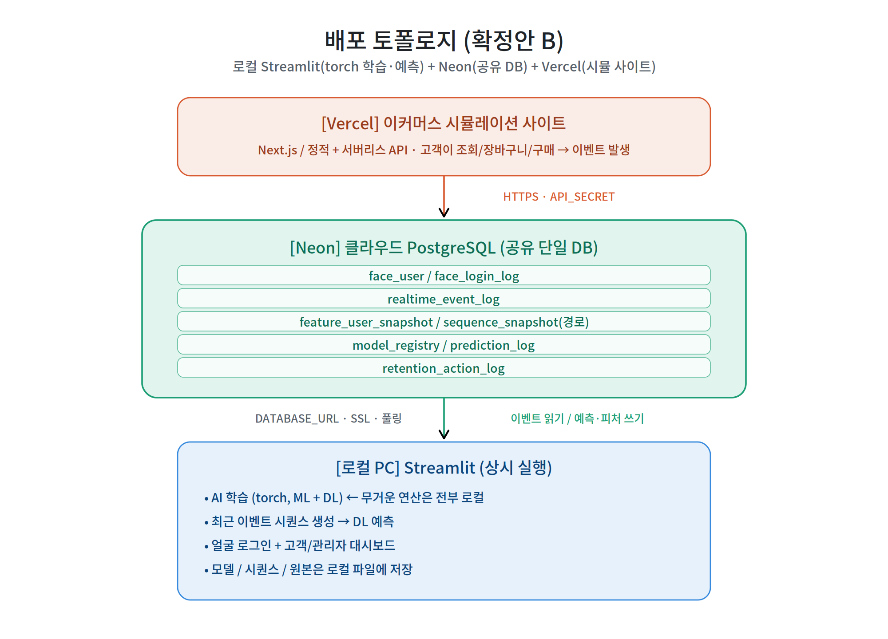
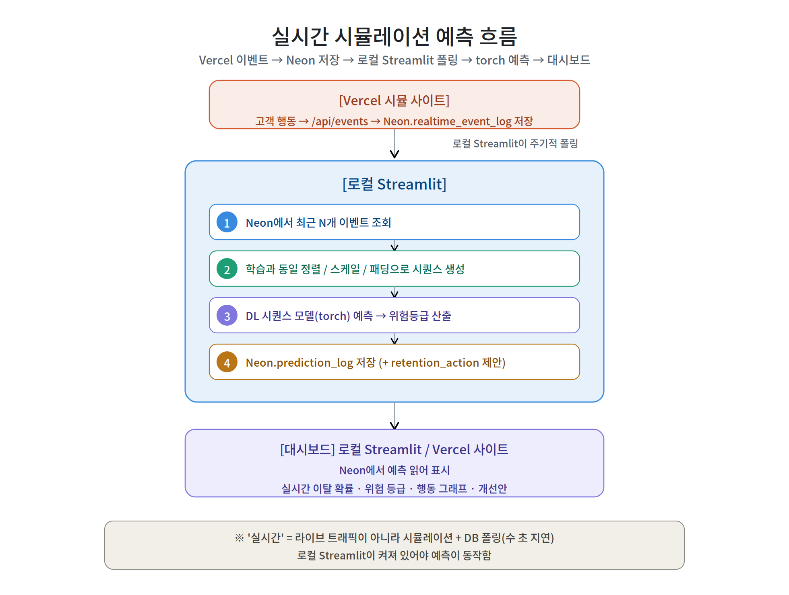
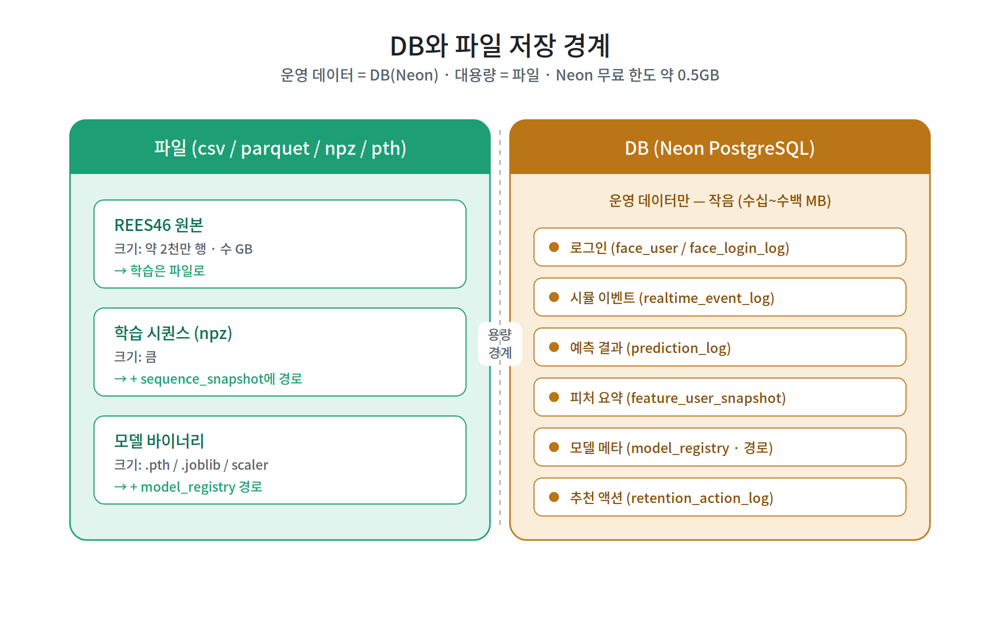
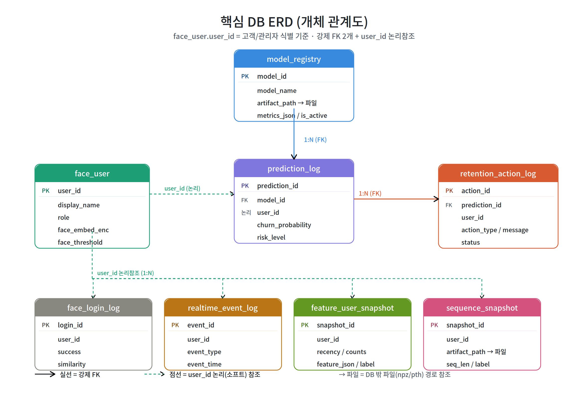
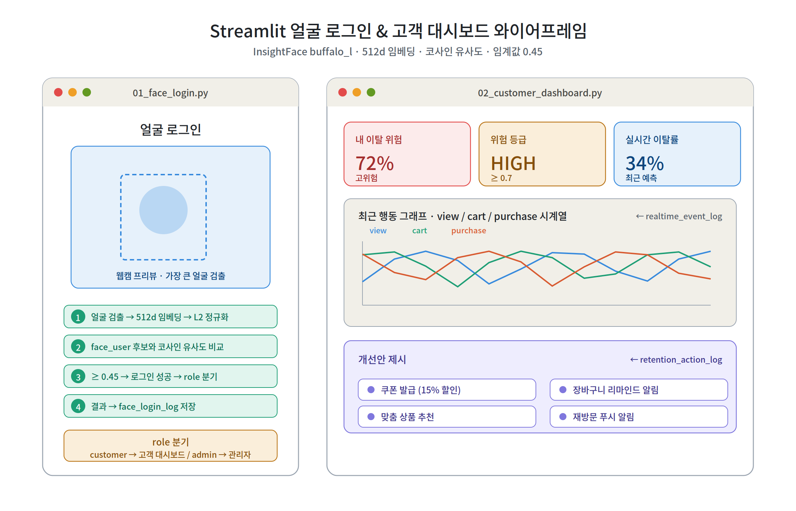
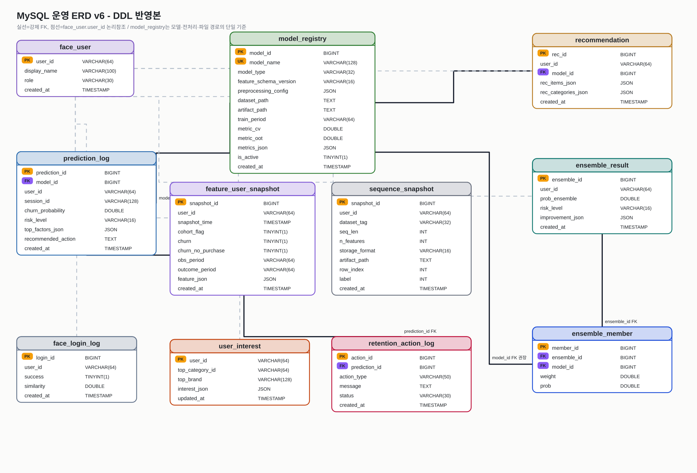

# 프로그램 구조도 · 함수/변수 명세서 v6-4

05-5(v5) 다음 버전. **5개월 정본(10피처·주별 시퀀스·운영 라벨 churn) + models7(7모델) + 호환성 재구성(스키마 v2 / registry 기반 전처리 분기)** 확정 사항을 반영하고, **백엔드 서버(Node.js, 별도 스레드)** 를 토폴로지에 정식 편입한다. 글 포맷은 v5를 유지한다.

기준 문서: [05-5](05-5_프로그램_구조도_및_함수_변수_비전_명세서.md) · [17-6-1](17-6-1_백엔드_DB_변경사항.md) · [17-6-5](17-6-5_5m_models7_호환성정합_및_개선_계획서.md) · [19 백엔드 DB 계획서](19_백엔드_DB_MySQL_계획서.md) · `data/processed_5m/meta_5m.json` · `preprocessing_project/*`는 백업/테스트 참고

**v6 주요 변경점**
- **백엔드 서버(Node.js) 정식 도입**: 기존 v5는 "Streamlit이 직접 Neon에 접속"이었으나, v6은 **dashboard_streamlit ↔ Node 백엔드 ↔ MySQL(운영) / Neon(시뮬 로그)** 3-tier로 분리. ML 추론은 모델파트가 별도로 수행하고 **결과값을 백엔드에 제출**한다.
- **운영 DB = MySQL**(모델 레지스트리·예측로그·피처 스냅샷·추천·리텐션), **시뮬레이션 로그 = Neon(Postgres)**. 대용량(1.27M 유저 피처·시퀀스)은 **DB 미적재 = 파일 + 경로**(불변).
- **스키마 v2 정합**: 10피처 canonical(`ndays`), 주별 시퀀스 + 마스크, 운영 라벨은 `churn` 단일 사용(`churn_no_purchase`는 분석/비상 보조로 보존). `model_registry`에 `preprocessing_config`/`dataset_path`/`metric_cv`/`metric_oot` 확장 → **registry 기반 전처리 분기**.
- **모델파트 → 백엔드 제출 인터페이스** 신설(`POST /models/submit`): 사전 전처리된 파일로 학습한 결과 변수(메트릭·전처리 config·artifact 경로·예측 배치)를 백엔드가 저장·관리.
- **신규 테이블** `user_interest`, `recommendation` 도입(추천 기능). **앙상블** 엔드포인트로 다모델 결합 개선점 표시.
- (여유 시) 결과를 **Neon으로 push** → 시뮬 사이트가 쿠폰/추천 표시(이탈예측→이탈방지 시연 루프 닫기).

**v6-4 보강점**
- `05-6-2`의 상세 구조·아키텍처·계약·운영 파트를 최대한 유지하고, 지금까지 합의한 변경점만 반영했다.
- `preprocessing_project/`는 메인 전처리 계층이 아니라 **백업·테스트·버전 비교용**으로 내리고, 전처리 정본은 `data/processed/` 단일 루트 아래 목적별 하위 폴더로 정리한다.
- 화면 폴더는 `frontend_streamlit` 대신 **`dashboard_streamlit/`**, Vercel/Neon 사이트는 **`simulation_site/`** 로 분리한다.
- 백엔드는 평면 8파일이 아니라 최소 클린아키텍처 계층(`interfaces/application/domain/infrastructure`)으로 표현한다.
- 운영 예측 라벨은 **`churn` 단일**로 통일한다. 대시보드 문구는 "향후 7일 이탈 확률"이다.
- 5개월 데이터 운용은 "4개월 train/test + 1개월 비상용 holdout 보존"으로 명시하고, `17/4 비대칭 제거` 같은 표현은 사용하지 않는다.

---

## 0. 아키텍처 결정 원칙 (v5 계승 + v6 보강)

v5의 4원칙(Thin API / 실용 L2+ / DB-파일 경계 / 추론위치)은 유지한다. v6은 **"추론위치"** 를 다음과 같이 갱신한다.

| 축 | v5 | **v6 (변경/보강)** |
| --- | --- | --- |
| 백엔드 | 없음(Streamlit이 DB 직접) | **Node.js 백엔드 서버(별도 스레드)** 가 운영 DB·API 단일 진입점 |
| 운영 DB | Neon(Postgres) 단일 | **MySQL(운영) + Neon(시뮬 로그)** 2-DB. 백엔드가 Neon에서 로그 pull → MySQL에 예측 적재 |
| 추론 주체 | 로컬 Streamlit torch | **모델파트 담당**(사전 전처리 파일로 학습) → 결과를 `POST /models/submit`/`/predict`로 백엔드 제출. 백엔드는 **레지스트리·앙상블·로그**를 담당(무거운 torch 번들 X) |
| 전처리 분기 | 코드 하드코딩 | `model_registry.preprocessing_config` 기반 **registry 분기**(트리=raw / 선형=log+scaler / 시퀀스=raw+mask) |
| 대용량 | 파일+경로 | **불변**. 1.27M 유저 피처/시퀀스는 parquet/npz, DB엔 `artifact_path`만 |

**불변 규칙**(v5 계승): 스케일러/인코더/이벤트ID 매핑은 **train 구간에서만 fit**, 모든 런타임은 동일 artifact를 **transform만**. v6에서는 그 artifact(`prep_{Model}.joblib`)의 **경로·config가 `model_registry`에 등록**되어야 한다.

### 0.1 PR / 리뷰 체크리스트 (v6 추가분)
- [ ] 백엔드 API에 ML **추론 코드 없음**(추론은 모델파트, 백엔드는 저장·조합·서빙)
- [ ] MySQL엔 운영 데이터만(레지스트리·예측·피처스냅샷·추천·리텐션). 1.27M 원본·시퀀스는 파일+경로
- [ ] 모델 제출은 `model_registry`에 `preprocessing_config`+`artifact_path`+`metrics` 동반
- [ ] Neon 비밀·MySQL 비밀은 **백엔드 env에만**(`dashboard_streamlit`/브라우저 노출 0)
- [ ] 운영 라벨 `churn`·10피처(`ndays`) 스키마 v2 준수(`churn_no_purchase`는 분석/보조 라벨로만 보존)

---

## 1. 전체 아키텍처 구조도

프리뷰 Mermaid 비표시 문제로 **ASCII 구조도** 유지(+하단 Mermaid fold).

### 1.1 전체 데이터·학습·서빙 파이프라인 (v6)

```
[REES46 5개월 원본 zip (2,069만 이벤트)]
      |  src/ingest_rees46.py · src/build_features.py
      v
+--------------------------------------------------+
| [A] data/processed/canonical_5m 정본 (전체 1.27M 유저) |
|   {train,test}_tabular.parquet  10피처+churn+np  |  (대용량=파일)
|   {train,test}_seq.npz          주별 [N,17/3,3]  |
+----------------+---------------------------------+
      | bayes_5m / finalize_5m_opt (코호트 recency<=7)
      v
+--------------------------------------------------+
| [B] 코호트·최적본  + ML_opt_scaler.joblib (저장)|
+----------------+---------------------------------+
      | models7_opt(개정 C') : prep_{Model}.joblib + models7_manifest.json
      v
+--------------------------------------------------+
| [C'] models7  (7모델 학습)  raw 단일정본 + 변환기|
|   메트릭/전처리config/artifact 경로 = 제출 대상  |
+----------------+---------------------------------+
      |  *** 모델파트 담당이 결과값을 백엔드에 제출 ***
      |  POST /models/submit  { model_name, type, preprocessing_config,
      |                         artifact_path, metrics_cv/oot, predictions[] }
      v
============================ 운영(서빙) ============================

 [simulation_site] 유저활동 시뮬 --/events--> [Neon Postgres] sim_event_log
                                                      |
            (Node 백엔드가 Neon에서 로그 pull) <------+
                     |
                     v  최근 이벤트 -> 피처/시퀀스 스냅샷 -> 선택 모델들로 점수
            [Node.js 백엔드 서버 (별도 스레드)]
                 - model_registry 기준 active 모델 분기(전처리 config)
                 - 실시간 이탈율 + 원인분석 + 앙상블 개선점
                 - prediction_log / ensemble / recommendation 적재
                     |  (MySQL = 운영 단일원천)
                     v
            [MySQL]  model_registry / prediction_log /
                     feature_user_snapshot / sequence_snapshot /
                     user_interest / recommendation / retention_action_log
                     |
                     v  REST(JSON)
            [dashboard_streamlit] 향후 7일 이탈확률·원인·추천·리텐션·앙상블 표시
                     |
                     v  (여유 시) 결과 push -> [Neon] -> 시뮬 사이트가 쿠폰/추천 노출
```

> 위가 **전체 흐름(전처리 → 제출 → 서빙 → 표시 → 방지 루프)**, 아래 1.2가 **배포 위치**다.

### 1.2 배포 토폴로지 (v6 확정안 B')

```
   [simulation_site] 이커머스 유저활동 시뮬 (Next.js/정적 + 서버리스)
        |  유저 조회/장바구니/구매 -> 이벤트 발생 (/events)
        v  (HTTPS, SIM_API_SECRET)
   +===============================================+
   |  [Neon]  Postgres  (시뮬 로그 전용)           |
   |    sim_event_log  (REES46 스키마)             |
   |    (옵션) coupon_push / rec_push  <- 백엔드가 push
   +======================^========================+
        pull 로그 |        | push 결과(여유 시)
                  v        |
   +===============================================+
   |  [Node.js 백엔드 서버]  (별도 스레드, 상시)   |
   |   /models/submit /predict /predict/realtime   |
   |   /recommend /retention-action /ensemble      |
   |   Neon pull worker + MySQL 운영 저장          |
   +======================^========================+
         REST(JSON)        | (mysql2 pool)
                  v        v
   +===============================================+
   |  [MySQL]  운영 DB (단일원천)                  |
   |   model_registry / prediction_log /           |
   |   feature_user_snapshot / sequence_snapshot / |
   |   user_interest / recommendation /            |
   |   retention_action_log / face_user(+log)      |
   +===============================================+
        ^                       ^
        | REST                  | 파일 경로 참조(읽기)
        |                       |
   [dashboard_streamlit]   [models/ 파일]  *.joblib *.pth *.parquet *.npz
     (얼굴로그인 + 고객/관리자)   (1.27M 피처/시퀀스 = DB 밖)
```

- **Node 백엔드** = 운영 DB·API 단일 진입점. Neon에서 로그 pull, 모델파트 제출 수신, MySQL 적재, `dashboard_streamlit`에 서빙.
- **dashboard_streamlit** = 표시·얼굴로그인 전용(추론·DB직결 제거 → 백엔드 REST 경유). torch 의존 제거 가능.
- **모델파트 담당** = 전처리된 파일로 학습 → **결과 변수만** 백엔드에 제출(무거운 연산은 백엔드 밖).

### 1.3 실시간(시뮬레이션) 예측 흐름 (v6)

```
[simulation_site] 유저활동 시뮬 -> /events -> Neon.sim_event_log
        |
        v  (Node 백엔드 pull worker, 수 초 주기)
[Node 백엔드 /predict/realtime]
  1. Neon에서 최근 N개 이벤트 조회 (since cursor)
  2. 학습 동일 정렬/집계로 feature_user_snapshot + sequence_snapshot(파일 경로) 생성
  3. model_registry active 모델 N종 로드(preprocessing_config로 분기)
     - 모델 점수 자체는 모델파트 제출본 or 경량 룰/선형 재현으로 산출
  4. 실시간 이탈율 + 원인분석(top_factors) 계산 -> prediction_log
  5. 앙상블(가중평균/스태킹)로 개선점 -> ensemble_result
  6. (여유 시) recommendation/retention_action 생성 -> (옵션) Neon push
        |
        v
[dashboard_streamlit] 백엔드 REST 조회 -> 향후 7일 이탈위험·원인·앙상블·추천 표시
```

> "실시간"은 라이브 트래픽이 아니라 **시뮬 + Neon 폴링(수 초 지연)**. Node 백엔드가 켜져 있어야 예측이 돈다(별도 스레드 worker).

### 1.4 입력/출력 기준 (IO 계약)

| 구분 | 입력 | 처리 주체 | 출력 |
| --- | --- | --- | --- |
| 원본 전처리 | REES46 5개월 zip | `src/` + `data/processed/` | parquet/npz **파일** + meta JSON |
| 모델 학습 | 전처리 파일 | **모델파트 담당** | `prep_{Model}.joblib`, `*.pth/.cbm`, manifest |
| **모델 제출** | manifest+metrics+predictions | 모델파트 → **Node `POST /models/submit`** | `model_registry` 행 + (배치)`prediction_log` |
| 시뮬 이벤트 | 사이트 유저활동 | simulation_site → Neon | `sim_event_log`(Neon) |
| 실시간 예측 | Neon 최근 이벤트 | **Node 백엔드** | `prediction_log`/`ensemble_result`(MySQL) |
| 추천 | `user_interest`+모델 | Node `/recommend` | `recommendation`(MySQL), (옵션)Neon push |
| 표시 | MySQL 운영데이터 | dashboard_streamlit ← Node REST | 대시보드 화면 |

**운영 원칙**: 팀 공유 단일원천 = **MySQL(운영)**. 시뮬 로그 = **Neon**. 1.27M 피처/시퀀스/모델바이너리 = **파일**(+DB 경로). DB는 작게.

---

## 2. 모델파트 → 백엔드 제출 인터페이스 (신규 ★)

각 모델파트 담당이 **사전 전처리된 파일로 학습**을 끝낸 뒤, 백엔드에 **결과값 변수**만 제출한다. 백엔드는 추론을 돌리지 않고 저장·관리·조합·서빙만 한다.

### 2.1 제출 계약 `POST /models/submit`

```jsonc
{
  "model_name": "CatBoost_ES_Feb",
  "model_type": "tree",                 // tree | linear | sequence | ensemble
  "feature_schema_version": "v2",       // 10피처 canonical(ndays)
  "preprocessing_config": {             // registry 기반 전처리 분기의 근거
    "scale": "none",                    // none(tree) | log1p+minmax(linear) | raw(seq)
    "scaler_path": null,                // 선형이면 prep_LogReg.joblib 경로
    "count_idx": ["ndays","n_events","n_view","n_cart","n_remove_from_cart","n_purchase","purch_amt"],
    "seq_granularity": null,            // 시퀀스면 "weekly", len, mask 여부
    "label": "churn"                    // 운영 기준: 향후 7일 이벤트 0개
  },
  "dataset_path": "data/processed/churn/models7/CatBoost_train.parquet",
  "artifact_path": "models/tabular/catboost_es_feb.cbm",
  "metrics": { "auc_cv": 0.7902, "auc_oot": 0.7902, "pr_auc": 0.41, "recall": 0.66 },
  "train_period": "2019-10-01..2020-01-31",
  "is_active": true,
  "predictions": [                      // (선택) 배치 스코어 결과 동봉
    { "user_id":"...", "churn_probability":0.83, "risk_level":"high",
      "top_factors": {"recency_days":21,"n_purchase":0} }
  ]
}
```

- **artifact/dataset는 경로만**(파일은 DB 밖). `preprocessing_config`가 서빙 분기의 single source of truth.
- `predictions[]`는 옵션: 모델파트가 오프라인 배치로 점수를 미리 내면 그대로 `prediction_log`에 적재(실시간이 아닌 데모용).

### 2.2 제출 후 백엔드 동작
1. `model_registry`에 upsert(`is_active=true`면 동일 type 기존 active 해제).
2. `predictions[]` 있으면 `prediction_log` 배치 insert(+위험등급/원인 보존).
3. `/predict/realtime`·`/ensemble`이 이 레지스트리를 읽어 분기·조합.

---

## 3. 데이터 흐름 다이어그램 (Neon ↔ 백엔드 ↔ dashboard_streamlit)

```
            제출(모델파트)              REST(표시)
   models7 ──────────────▶ [Node 백엔드] ◀────────── [dashboard_streamlit]
   prep.joblib/manifest        │  ▲                    얼굴로그인 + 고객/관리자
                               │  │
                      pull로그 │  │ push결과(여유 시)
                               ▼  │
                          [Neon Postgres]  sim_event_log
                               ▲
                        /events│
                   [simulation_site] 유저활동 시뮬 -> 쿠폰/추천 노출(루프)
                               
   [Node 백엔드] ──운영저장/조회──▶ [MySQL]  registry/prediction/feature/
                                            sequence/user_interest/recommendation/
                                            retention/ face
```

- **방향성**: 모델파트→백엔드(제출), Neon→백엔드(pull), 백엔드→MySQL(저장), 백엔드→dashboard_streamlit(서빙), 백엔드→Neon(push, 옵션).
- dashboard_streamlit·simulation_site는 **MySQL/Neon에 직접 접속하지 않고** 모두 백엔드(또는 시뮬 자체 API)를 경유 → 비밀 분리·계약 단일화.

---

## 4. MySQL 운영 ERD (v6)

`face_user.user_id`가 고객/관리자 식별 기준(논리참조). 강제 FK는 `prediction_log.model_id→model_registry`, `recommendation.model_id→model_registry`, `retention_action_log.prediction_id→prediction_log`, `ensemble_result`는 prediction 다대다를 `ensemble_member`로 연결.

```
                     +-------------------------------------------+
                     | model_registry                            |
                     | PK model_id                               |
                     |  model_name / model_type                  |
                     |  preprocessing_config(JSON)  <-- 분기근거 |
                     |  dataset_path / artifact_path  --> 파일   |
                     |  metric_cv / metric_oot / is_active       |
                     +----+--------------------+-----------------+
                          | 1                  | 1
                 model_id | (FK)      model_id | (FK)
                          v N                  v N
 +--------------+   +--------------------+   +----------------------+
 | face_user    |1 N| prediction_log     |   | recommendation       |
 | PK user_id   |--<| PK prediction_id   |   | PK rec_id            |
 |  display_name|   |  user_id(논리)     |   |  user_id / model_id  |
 |  role        |   |  model_id (FK)     |   |  rec_items_json      |
 +--+--+--+--+--+   |  churn_probability |   |  rec_categories_json |
    |  |  |  |      |  risk_level        |   +----------------------+
    |  |  |  |      |  top_factors_json  |
    |  |  |  |      +----+---------------+
    |  |  |  |           | 1 (FK prediction_id)
    |  |  |  |           v N
    |  |  |  |      +----------------------+      +----------------------+
    |  |  |  |      | retention_action_log |      | ensemble_result      |
    |  |  |  |      | PK action_id         |      | PK ensemble_id       |
    |  |  |  |      |  prediction_id (FK)  |      |  user_id             |
    |  |  |  |      |  action_type/message |      |  prob_ensemble       |
    |  |  |  |      |  status              |      |  improvement_json    |
    |  |  |  |      +----------------------+      +----+-----------------+
    |  |  |  |                                         | 1
    |  |  |  |                              ensemble_id| (FK)
    |  |  |  |                                         v N
    |N |N |N |N (user_id 논리참조 1:N)                +----------------------+
 +--------------+ +-----------------+ +-------------+ | ensemble_member      |
 |face_login_log| |feature_user_snap| |user_interest| |  PK member_id        |
 |PK login_id   | |PK snapshot_id   | |PK user_id   | |  ensemble_id (FK)    |
 |  user_id     | |  churn/churn_np | |  top_cat    | |  model_id            |
 |  success/sim | |  cohort_flag    | |  top_brand  | |  weight / prob       |
 +--------------+ |  feature_json   | |  interest   | +----------------------+
                  +-----------------+ +-------------+
 +----------------------+
 | sequence_snapshot    |   artifact_path --> 파일(npz, DB 밖)
 | PK snapshot_id       |   dataset_tag / seq_len / n_features / label
 +----------------------+
```

**관계 요약**

| 부모(1) | 자식(N) | 키 | FK |
| --- | --- | --- | --- |
| `model_registry` | `prediction_log` | model_id | **FK** |
| `model_registry` | `recommendation` | model_id | **FK** |
| `model_registry` | `ensemble_member` | model_id | 논리 |
| `prediction_log` | `retention_action_log` | prediction_id | **FK** |
| `ensemble_result` | `ensemble_member` | ensemble_id | **FK** |
| `face_user` | `prediction_log`/`recommendation`/`feature_user_snapshot`/`sequence_snapshot`/`user_interest`/`face_login_log` | user_id | 논리 |

> 파일 참조: `model_registry.artifact_path`/`dataset_path`, `sequence_snapshot.artifact_path`는 DB 밖 파일(joblib/pth/parquet/npz). DDL은 [19 계획서](19_백엔드_DB_MySQL_계획서.md) §3 및 `backend/db/schema_mysql.sql`.

<details><summary>Mermaid ERD (지원 뷰어용)</summary>


</details>

---

## 5. 스키마 v2 정합 (17-6-5 반영)

| 항목 | v1 배포본 | **v2 정합(본 문서 기준)** |
| --- | --- | --- |
| 정형 피처 | 7(`active_days`) | **10 canonical**(`recency_days,tenure_days,ndays,n_events,n_view,n_cart,n_remove_from_cart,n_purchase,avg_price,purch_amt`) |
| 활동일수 | `active_days` | `ndays` (매핑표로 v1 폴백) |
| 시퀀스 | 일별 [N,14,3] | **주별 시퀀스 + 패딩 마스크**(4개월 train/test 운용, 1개월 비상용 holdout 보존) |
| 라벨 | churn | **운영=churn 단일**(`churn_no_purchase`는 분석/보조 라벨로 보존) |
| 전처리기 | seq_scaler✅ | **prep_{Model}.joblib + manifest**(registry 등록) |
| registry | 미확장 | **preprocessing_config/dataset_path/metric_cv/oot/model_type** |

서빙 분기 규칙(registry 기반): **tree=raw** / **linear=log1p+minmax(scaler 로드)** / **sequence=raw+mask**. 분기 근거는 `model_registry.preprocessing_config`.

---

## 6. 폴더 · 모듈 책임 (v6-4 상세 구조)

`05-6-2`의 상세 설명을 유지하되, 실제 운영 구조는 아래처럼 정리한다. 전처리 정본은 `data/processed/` 단일 루트에 두고, `preprocessing_project/`는 백업·테스트·버전 비교용으로만 둔다.

> **구조 원칙**: 백엔드는 독립 애플리케이션(`backend/`)이고, 화면은 `dashboard_streamlit/`, 시뮬레이션 사이트는 `simulation_site/`로 분리한다. 백엔드 내부는 최소 클린아키텍처 계층(`interfaces/application/domain/infrastructure`)만 둔다.

```
team_project_churn/
├── data/
│   ├── raw/                         REES46 원본 CSV/zip (대용량, 파일 보관)
│   ├── processed/                   최종 전처리 산출물 단일 루트
│   │   ├── canonical_5m/             공통 정본 view
│   │   │   ├── events.parquet        정제 이벤트(필요 컬럼 보존)
│   │   │   ├── users.parquet         유저 기준 메타/기간 요약
│   │   │   ├── catalog.parquet       product/category/brand 카탈로그
│   │   │   └── meta_5m.json          기간·행수·라벨·피처 스키마
│   │   ├── churn/                    향후 7일 이탈 확률 모델용
│   │   │   ├── train_tabular.parquet / test_tabular.parquet
│   │   │   ├── train_seq.npz / test_seq.npz
│   │   │   ├── train_tabular_ML_opt.parquet / test_tabular_ML_opt.parquet
│   │   │   ├── train_seq_DL_opt.npz / test_seq_DL_opt.npz
│   │   │   └── models7/              모델별 입력 파일(raw/scaled/seq)
│   │   ├── recommendation/           추천용 user-interest/item 후보 view
│   │   │   ├── rec_user_interest_5m.parquet
│   │   │   ├── rec_user_top_categories.parquet
│   │   │   ├── rec_item_popularity.parquet
│   │   │   └── meta_rec.json
│   │   ├── next_category/            다음 카테고리 예측용
│   │   │   ├── nextcat_dataset.npz
│   │   │   ├── nextcat_dataset_fullwin.npz
│   │   │   ├── nextcat_meta.json
│   │   │   └── gbm_rank_features.parquet   (추가 후보: GBM/LightGBM ranker)
│   │   └── evaluation/               학습 후 평가/시각화 산출물
│   │       ├── eval_predictions.parquet
│   │       ├── metrics_summary.json
│   │       ├── threshold_curve.json
│   │       ├── calibration_curve.json
│   │       ├── lift_curve.json
│   │       ├── shap_summary.json
│   │       └── business_value.json
│   └── exports/                      DB에서 내려받은 발표/검증용 샘플
├── db/                               공통 SQL·로컬 검증용 DB 유틸
│   ├── schema.sql                    레거시/SQLite/Postgres 초안 DDL
│   ├── queries.sql                   자주 쓰는 조회 쿼리
│   ├── seed_demo_users.sql           데모 사용자/권한 seed
│   └── db_client.py                  Python DB 접속/insert/select 공통 함수
├── configs/
│   ├── db.example.env                DB 접속 환경변수 예시
│   ├── model_params.yaml             ML/DL 하이퍼파라미터
│   ├── realtime_params.yaml          실시간 조회/임계값/세션 파라미터
│   └── feature_schema.yaml           feature/sequence 컬럼 스키마
├── notebooks/colab/                  (선택) GPU 학습용 노트북 + colab_outputs/
├── src/                              모델파트·전처리 실행 스크립트
│   ├── ingest_rees46.py              REES46 CSV 정제·요약 적재(작은 요약만 DB)
│   ├── build_features.py             피처/시퀀스 파일 생성(+DB 경로 등록)
│   ├── train_ml.py                   ML 학습·평가
│   ├── train_dl.py                   DL(LSTM/Transformer) 학습·평가
│   ├── compare.py                    지표 비교·최적 모델/manifest 생성
│   ├── predict.py                    단건 예측 smoke test
│   └── export_model_run.py           모델 제출 패키지 생성(manifest/eval artifacts)
├── backend/                          운영 API + MySQL 단일 진입점
│   ├── package.json
│   ├── .env.example
│   ├── README.md
│   ├── CONTRACT.md                   모델파트→서버 공유변수 계약
│   ├── db/
│   │   ├── schema_mysql.sql           운영 MySQL DDL
│   │   ├── seed.sql                   데모 시드
│   │   └── migrations/                스키마 변경 이력
│   └── src/
│       ├── server.js                  HTTP/Fastify entrypoint
│       ├── config.js                  env 로딩·검증
│       ├── interfaces/http/           routes/controllers
│       │   ├── models.routes.js
│       │   ├── predictions.routes.js
│       │   ├── dashboard.routes.js
│       │   ├── recommendations.routes.js
│       │   └── health.routes.js
│       ├── application/               usecase 계층
│       │   ├── submitModel.usecase.js
│       │   ├── importEvaluation.usecase.js
│       │   ├── realtimePredict.usecase.js
│       │   ├── getDashboard.usecase.js
│       │   ├── createRecommendation.usecase.js
│       │   └── createRetentionAction.usecase.js
│       ├── domain/                    순수 규칙·엔티티
│       │   ├── modelRegistry.js
│       │   ├── modelEvaluation.js
│       │   ├── prediction.js
│       │   ├── recommendation.js
│       │   └── retentionAction.js
│       ├── infrastructure/
│       │   ├── mysql/                 운영 DB adapter
│       │   │   ├── pool.js
│       │   │   ├── modelRepository.js
│       │   │   ├── evaluationRepository.js
│       │   │   ├── predictionRepository.js
│       │   │   └── dashboardRepository.js
│       │   ├── external/neon/         시뮬 사이트 이벤트 외부 adapter
│       │   │   └── simEventRepository.js
│       │   └── files/                 artifact path/file reader
│       │       └── artifactStore.js
│       └── validators/
│           ├── modelSubmit.schema.js
│           └── evaluation.schema.js
├── dashboard_streamlit/               고객/관리자 대시보드(Streamlit)
│   ├── app.py
│   ├── pages/
│   │   ├── 01_face_login.py
│   │   ├── 02_customer_dashboard.py
│   │   └── 03_admin_dashboard.py
│   └── services/
│       ├── api_client.py              backend REST 호출
│       ├── face_auth.py               InsightFace 얼굴 인증
│       └── chart_service.py           chart-ready JSON 표시 보조
├── simulation_site/                   Vercel/Neon 이커머스 시뮬레이션
│   ├── app/ 또는 pages/               고객 행동 시뮬 UI
│   ├── api/                           events/recommendation push 표시용 thin API
│   ├── neon/
│   │   ├── schema_neon.sql            sim_event_log 등 시뮬 로그 DDL
│   │   └── seed.sql
│   └── README.md
├── models/
│   ├── churn/                         이탈 예측 모델(LogReg/GBM/XGB/LGBM/CatBoost/LSTM/Transformer)
│   ├── recommendation/                추천 모델/룰(Popularity, ItemCF, SASRec 후보)
│   ├── next_category/                 Last-category, GRU/SASRec, GBM/LightGBM ranker 후보
│   └── preprocessors/                 scaler/encoder/prep_{Model}.joblib
├── outputs/
│   ├── metrics/                       성능 지표 JSON
│   ├── evaluation/                    eval_predictions/curves/shap/business
│   ├── plots/                         발표 그래프
│   ├── sequences/                     시퀀스 샘플/검증 산출
│   └── realtime/                      실시간 리플레이·시뮬 결과
├── reports/                           계획서·점검리포트·ERD·이미지
├── sample_project/                    백업·참고 구현(읽기/비교용)
└── preprocessing_project/             백업·테스트·버전 비교용(정본 경로 아님)
```

| 모듈/폴더 | 입력 | 출력 | 책임 |
| --- | --- | --- | --- |
| `data/processed/canonical_5m` | REES46 5개월 원본 | 공통 parquet/meta | 목적별 view의 단일 원천 |
| `data/processed/churn` | canonical_5m | churn 학습셋 | 향후 7일 이탈 확률 모델 |
| `data/processed/recommendation` | canonical_5m | 유저 관심/인기/후보 | 추천·리텐션 액션 후보 |
| `data/processed/next_category` | canonical_5m | nextcat npz/ranker features | 다음 카테고리 예측 |
| `src/` | `data/raw`, `data/processed` | 모델·평가 산출물 | 학습/검증/제출 패키지 생성 |
| `backend/interfaces/http` | HTTP request | JSON | 라우팅·DTO 검증 |
| `backend/application` | DTO, repository port | usecase result | 모델 제출·평가 import·대시보드 조회 |
| `backend/domain` | 순수 값/규칙 | domain object | 위험등급·앙상블·리텐션 규칙 |
| `backend/infrastructure/mysql` | SQL/MySQL | row/document | 운영 DB 저장·조회 |
| `backend/infrastructure/external/neon` | Neon sim log | events | 외부 시뮬 이벤트 adapter |
| `dashboard_streamlit` | backend REST | 화면 | 고객/관리자 대시보드 |
| `simulation_site` | 사용자 행동 | Neon event | 이커머스 시뮬레이션 |
| `sample_project`, `preprocessing_project` | 기존 실험물 | 비교 참고 | 백업·테스트·마이그레이션 참고 |

---

## 7. 함수/변수 명세 (백엔드 핵심)

| 함수 | 시그니처(개념) | 설명 |
| --- | --- | --- |
| `modelService.submit(dto)` | dto → {model_id} | registry upsert + (옵션)배치 prediction 적재 |
| `modelService.listActive(type)` | type → rows | 분기용 active 모델 조회 |
| `predictService.realtime(opts)` | {limit,models} → rows | Neon pull→스냅샷→분기점수→prediction_log |
| `predictService.scoreOne(snap,model)` | (snap,model) → prob | preprocessing_config로 transform 후 점수 |
| `ensembleService.combine(probs,weights)` | → {prob,improvement} | 가중평균/스태킹 + 개선점 |
| `recommendService.forUser(uid)` | uid → items | user_interest×모델, view1/cart3/purchase5 |
| `retentionService.suggest(pred)` | pred → action | risk별 쿠폰/리마인드 |
| `neonPull.poll(cursor)` | cursor → events | sim_event_log since cursor |

| 변수(env/상수) | 기본 | 의미 |
| --- | ---: | --- |
| `PORT` | 8080 | 백엔드 리슨 |
| `MYSQL_URL` | — | 운영 DB(풀) |
| `NEON_URL` | — | 시뮬 로그(SSL·풀) |
| `API_KEY` | — | 내부 인증 헤더 |
| `RISK_LOW/HIGH` | 0.35/0.65 | 위험등급 임계값(17-6-5) |
| `PULL_INTERVAL_MS` | 5000 | Neon pull 주기 |
| `ENSEMBLE_WEIGHTS` | auto | 모델 가중(미지정=AUC 비례) |
| `FEATURE_SCHEMA_VERSION` | v2 | 10피처 canonical |

---

## 8. 실시간 IO 계약(요약) · 배포

API 상세는 [19 계획서](19_백엔드_DB_MySQL_계획서.md) §4. 배포: 백엔드(Node)는 상시 실행(별도 스레드/프로세스), MySQL은 로컬/관리형, Neon은 시뮬 로그 전용, `dashboard_streamlit`은 백엔드 REST만 호출.

```
1. MySQL 생성 -> backend/db/schema_mysql.sql 적용
2. 전처리 파일 준비(data/processed/churn, prep_{Model}.joblib) — 모델파트
3. 모델파트가 POST /models/submit 으로 결과 제출 -> model_registry
4. simulation_site -> Neon.sim_event_log 적재
5. Node 백엔드 pull worker가 Neon 폴링 -> /predict/realtime -> prediction_log
6. /ensemble 로 앙상블 개선점, /recommend·/retention-action 으로 방지 액션
7. dashboard_streamlit이 백엔드 REST로 표시. (여유 시) 결과 Neon push -> 사이트 쿠폰
```

---

## 9. 주의사항 (v6)
- **백엔드에 torch/추론 코드 금지**. 추론은 모델파트가 파일로 수행→제출. 백엔드는 저장·조합·서빙.
- MySQL = 운영, Neon = 시뮬 로그. **둘 다 비밀은 백엔드 env에만**. dashboard_streamlit/사이트는 직접 접속 금지.
- 1.27M 유저 피처·시퀀스·모델바이너리는 **파일+경로**(MySQL 미적재). Neon free 한도 보호 동일.
- 스키마 v2(10피처·운영 라벨 churn·주별 시퀀스) 준수, registry 기반 전처리 분기.
- 기존 `sample_project`/`preprocessing_project` 산출물은 **백업·테스트·비교용 읽기 전용**. 신규 운영 구조는 `data/`, `src/`, `backend/`, `dashboard_streamlit/`, `simulation_site/` 기준으로 추가한다.
- "실시간"은 시뮬+Neon 폴링(수 초 지연). 백엔드 상시 실행 전제.

---

## 10. 학습 환경 (v5 계승, v6 역할 분리)

추론·학습을 백엔드에 밀어 넣지 않는다. v6 기준 학습·전처리 실행은 **`src/`와 `data/processed` 정본**을 기준으로 하고, 백엔드는 학습 종료 후 생성된 산출물 패키지를 검증·등록·서빙한다.

| 단계 | 환경 | 입력 | 산출물 | v6 책임 |
| --- | --- | --- | --- | --- |
| EDA/라벨 검증 | 로컬/Colab | REES46 5개월 원본·정제 파일 | 분포표·라벨 검증 그래프 | 모델파트 |
| 피처/시퀀스 생성 | 로컬 | 정제 이벤트 | `data/processed/{canonical_5m,churn}/*.parquet`, `*.npz`, meta JSON | `src/` + `data/processed` |
| ML 학습 | 로컬/Colab | 모델별 전처리 파일 | `.joblib/.cbm`, metrics, feature importance | 모델파트 |
| DL 학습 | 로컬/Colab(GPU) | 시퀀스 npz + mask | `.pth`, metrics, train/val history | 모델파트 |
| 검증 산출물 생성 | 로컬/Colab | `y_true`, `y_score`, model outputs | PR/ROC/threshold/calibration/lift/SHAP JSON | 모델파트 |
| 등록/서빙 | Node 백엔드 | manifest + artifacts path | `model_registry`, `model_evaluation`, chart API | 백엔드 |

**공유 순서**: `data/processed/churn` 확정 → `models7` 학습 → `model_run_manifest.json` 작성 → `POST /models/submit` → 백엔드가 `model_registry`/평가 요약 저장 → `dashboard_streamlit` 표시.

---

## 11. 모델별 추가 전처리

DB와 파일 경계가 명확해도 모델별 입력 형태는 다르다. v6에서는 이 차이를 코드 하드코딩이 아니라 `model_registry.preprocessing_config`로 보존한다.

| 모델/화면 | 추가 전처리 | artifact/config |
| --- | --- | --- |
| DecisionTree/RandomForest | raw 10피처, 컬럼 순서 고정 | `scale=none`, `feature_schema_version=v2` |
| XGBoost/LightGBM/CatBoost | raw 10피처, 불균형 파라미터/early stopping | `model_type=tree`, `prep_path=null` |
| LogReg | count 계열 `log1p`, scaler, SMOTE 여부 기록 | `prep_LogReg.joblib`, `scale=log1p+minmax` |
| LSTM/Transformer | 주별 시퀀스, padding mask, label 선택 | `seq_granularity=weekly`, `mask=true` |
| 실시간 스냅샷 | Neon 최근 이벤트 → 학습 동일 피처/시퀀스 생성 | `feature_user_snapshot`, `sequence_snapshot` |
| 대시보드 그래프 | 시간 집계, 위험등급 bucket, 모델별 metric join | 백엔드 chart API |

**불변 규칙**: scaler/encoder/이벤트 매핑은 train 구간에서만 fit, 제출·서빙·실시간 변환은 저장된 artifact로 transform만 수행한다.

---

## 12. dashboard_streamlit 얼굴 로그인 & 대시보드 (v6)

v5에서는 Streamlit이 DB와 모델을 직접 다뤘지만, v6에서는 **`dashboard_streamlit`은 화면·얼굴 로그인·조회 UI**이고 데이터 접근은 백엔드 REST로 통일한다.

### 12.1 얼굴 로그인 흐름

```
[등록] ID 입력 -> 중복 확인 -> 얼굴 검출 -> 512d 임베딩 -> L2 정규화 -> 암호화 후 face_user 저장
[로그인] 얼굴 검출 -> 임베딩 정규화 -> 후보와 cosine similarity -> threshold 이상 성공
       -> face_login_log 저장 -> role(customer/admin) 분기
```

`opencv_face_login` 기준: `InsightFace FaceAnalysis("buffalo_l")`, 512차원 임베딩, 코사인 유사도, 기본 임계값 `0.45`.

### 12.2 고객 대시보드

| 영역 | 내용 | 백엔드/DB 출처 |
| --- | --- | --- |
| 내 이탈 위험 | 향후 7일 이탈 확률·위험 등급·최근 예측 시각 | `/predictions/latest`, `prediction_log` |
| 최근 행동 그래프 | view/cart/purchase 시계열, 세션 흐름 | `/events/recent`, Neon pull 요약 |
| 원인 요약 | top factors, 최근 행동 변화 | `top_factors_json`, `feature_user_snapshot` |
| 개선안 | 쿠폰·장바구니 리마인드·추천·재방문 알림 | `retention_action_log`, `recommendation` |
| 추천 이력 | 추천 상품/카테고리와 상태 | `recommendation`, `user_interest` |

### 12.3 관리자 대시보드

전체 위험 비율, 위험등급 분포, 이벤트 퍼널, active 모델 성능, 모델별 PR-AUC/ROC-AUC, threshold, calibration, lift, SHAP summary, 고위험 고객 Top N, 리텐션 액션 상태를 조회한다. 화면은 `dashboard_streamlit`이 그리되 계산 결과는 백엔드 chart API에서 받는다.

### 12.4 환경 주의

- 로컬 실행은 웹캠 사용 가능. Windows에서 `insightface` 설치 시 VS Build Tools(C++)가 필요할 수 있다.
- 서버/리눅스에서는 `build-essential` + `cmake`가 필요할 수 있고, 헤드리스 환경은 카메라가 없으므로 브라우저에서 캡처한 이미지를 서버에 전달하는 방식이 안전하다.
- 얼굴 원본 이미지는 저장하지 않는 것을 기본으로 하고, 임베딩은 암호화·동의 문구·접근권한을 별도로 관리한다.

---

## 13. simulation_site & Thin API (v5 Vercel 파트 계승)

Vercel/시뮬 사이트는 **이커머스 행동을 발생시키는 얇은 프론트/API**다. ML 추론과 모델 검증은 넣지 않는다.

| Endpoint | Method | 입력 | 출력 | 책임 |
| --- | --- | --- | --- | --- |
| `/api/events` | POST | user/session/event/product/price/time | event id | Neon `sim_event_log` 저장 |
| `/api/events/recent` | GET | `user_id`, `limit` | 최근 이벤트 | 시뮬 UI/디버그 조회 |
| `/api/predictions/latest` | GET | `user_id` | 최근 예측 | 사이트에 위험/쿠폰 표시(옵션) |
| `/api/recommendations/latest` | GET | `user_id` | 추천 상품/카테고리 | 방지 루프 시연 |
| `/api/auth/login-log` | POST | login result | login id | 얼굴 로그인 로그 위임 시 |

환경변수는 `DATABASE_URL`/`NEON_URL`, `SIM_API_SECRET`, `API_SECRET`, `PRED_THRESHOLD_LOW/HIGH`를 서버 env에만 둔다. 브라우저 번들에 DB 비밀이 들어가면 안 된다.

---

## 14. 파라미터와 하이퍼파라미터

### 14.1 공통

| 파라미터 | 권장값 | 의미 |
| --- | ---: | --- |
| `SEED` | `42` | 재현성 |
| `SOURCE_DATASET` | `REES46_5M` | 최종 데이터 소스 |
| `FEATURE_SCHEMA_VERSION` | `v2` | 10피처 canonical |
| `POSITIVE_CLASS` | `1` | 이탈 라벨 |
| `TRAIN_SPLIT_MODE` | `temporal` | 시계열 누수 방지 |
| `METRIC_PRIMARY` | `pr_auc` | 발표/불균형 데이터 메인 지표 |
| `METRIC_SECONDARY` | `roc_auc, recall, f1` | 보조 지표 |
| `RISK_LOW/HIGH` | `0.35 / 0.65` | 운영 위험등급 |

### 14.2 시퀀스

| 파라미터 | 권장값 | 의미 |
| --- | ---: | --- |
| `SEQ_GRANULARITY` | `weekly` | v2 시퀀스 단위 |
| `SEQ_LEN_TRAIN` | `17` | train 주차 길이 |
| `SEQ_LEN_TEST` | `4` 또는 패딩 후 고정길이 | test 주차 길이 |
| `N_SEQ_FEATURES` | `3` | view/cart/purchase 계열 |
| `USE_MASK` | `true` | padding 제외 |
| `MIN_SEQ_LEN` | `3` | 최소 신뢰 길이 |
| `PAD_VALUE` | `0` | padding 값 |

### 14.3 DL 하이퍼파라미터

| | LSTM | Transformer | 비고 |
| --- | ---: | ---: | --- |
| batch_size | 128 | 128 | 데이터 크기 따라 조정 |
| epochs | 30 | 30 | early stopping |
| learning_rate | 1e-3 | 5e-4 | Transformer는 낮게 |
| weight_decay | 1e-4 | 1e-4 | 과적합 완화 |
| embedding_dim | 32 | 32 | |
| hidden_dim | 64 | 64 | |
| num_layers | 1~2 | 2 | |
| dropout | 0.2~0.3 | 0.2~0.3 | |
| n_heads | - | 4 | attention heads |
| loss | BCEWithLogitsLoss(+pos_weight) | 동일 | 불균형 대응 |
| optimizer | AdamW | AdamW | |
| early_stopping_patience | 5 | 5 | 검증 PR-AUC/AUC 기준 |

### 14.4 백엔드·얼굴 로그인

| 파라미터 | 권장값 | 의미 |
| --- | ---: | --- |
| `PORT` | `8080` | Node 백엔드 |
| `PULL_INTERVAL_MS` | `5000` | Neon pull 주기 |
| `ENSEMBLE_WEIGHTS` | `auto` | metric 기반 가중 |
| `FACE_MODEL_NAME` | `buffalo_l` | InsightFace 모델팩 |
| `FACE_DET_SIZE` | `(640,640)` | 검출 입력 크기 |
| `FACE_SIM_THRESHOLD` | `0.45` | 로그인 임계값 |
| `MAX_LOGIN_FAILS` | `5` | 실패 제한 |
| `FACE_EMBEDDING_DIM` | `512` | 임베딩 차원 |

---

## 15. 산출물 공유 방식

v6에서는 "모델파일만 공유"가 아니라, **학습 결과를 재현·검증·서빙할 수 있는 패키지**로 제출한다.

| 작업 | 산출물 | 위치 | 공유 기준 |
| --- | --- | --- | --- |
| 원본 정제 | 정제 파일·요약 | `data/processed/canonical_5m/`, meta JSON | 행 수/기간/라벨 검산 |
| 라벨/피처 | tabular parquet, seq npz | `data/processed/churn/` + DB 경로 | 10피처·운영 라벨 churn·시퀀스 shape |
| ML 학습 | model, prep artifact, metrics | `models/churn/`, `model_registry` | `preprocessing_config` 포함 |
| DL 학습 | `.pth`, metrics, loss curve | `models/churn/`, evaluation artifact | train/val history 포함 |
| 검증 그래프 | `eval_predictions.parquet`, curves JSON | `outputs/evaluation/` + 경로 | PR/ROC/threshold/calibration/lift/SHAP |
| 실시간 예측 | prediction rows | `prediction_log` | 화면=DB 일치 검산 |
| 추천/리텐션 | recommendation/action rows | `recommendation`, `retention_action_log` | 쿠폰/추천 시연 |
| 얼굴 로그인 | login rows | `face_login_log` | 성공/실패/유사도 |
| 발표 문서 | 구조도·결과표·스크린샷 | `reports/`, `outputs/plots/` | 보고서 기준 |

권장 제출 패키지:

```text
model_run_manifest.json
eval_predictions.parquet
metrics_summary.json
training_history.json
threshold_curve.json
calibration_curve.json
lift_curve.json
shap_summary.json
business_value.json
```

---

## 16. 실행 순서

```text
1. MySQL 운영 DB 생성 -> backend/db/schema_mysql.sql 적용
2. Neon 시뮬 로그 DB 준비 -> simulation_site /events 연결
3. REES46 5개월 전처리 -> data/processed/{canonical_5m,churn,recommendation,next_category} 확정
4. 모델파트가 models7 학습 -> 모델 파일, 전처리 artifact, 검증 산출물 생성
5. POST /models/submit -> model_registry + model_evaluation + 선택 batch prediction 등록
6. Node 백엔드 상시 실행 -> Neon pull worker 시작
7. simulation_site에서 고객 행동 시뮬레이션 -> Neon sim_event_log 저장
8. 백엔드가 최근 이벤트를 읽어 feature/sequence snapshot 생성 -> prediction/ensemble/recommendation 저장
9. dashboard_streamlit이 백엔드 REST 조회 -> 고객/관리자 화면 표시
10. 여유 시 백엔드 결과를 Neon으로 push -> 시뮬 사이트가 쿠폰/추천 노출
```

---

## 17. 배포 옵션 비교

| 옵션 | 구성 | 추론/검증 | 장점 | 단점 |
| --- | --- | --- | --- | --- |
| A. 전부 Vercel | Next.js + 서버리스 + Neon | ONNX/경량 모델만 가능 | 단일 배포 | torch/SHAP/대용량 검증 부적합 |
| **B'. 현재 v6 확정** | **Node 백엔드 + MySQL + Neon 시뮬 + dashboard_streamlit** | **모델파트 산출물 제출, 백엔드는 ingest/서빙** | 클린아키텍처 경계 명확, 발표 대시보드 확장 쉬움 | 백엔드 상시 실행 필요 |
| C. OCI/VM 올인원 | VM에 MySQL/Postgres/Node/Streamlit | VM에서 학습·추론 가능 | 노트북 불필요, 원본 저장 여유 | 서버 관리 부담, GPU 없음 |

**B' 선택 이유**: 모델 학습·검증은 모델파트가 책임지고, 백엔드는 운영 데이터와 API 계약만 책임진다. 프론트는 chart-ready JSON을 받아 그리므로 역할 경계가 가장 명확하다.

---

## 18. 시각화 자료 이미지

`05-5`에서 만든 이미지 자산은 v6 문서에서도 계속 사용한다. v6에서 바뀐 ERD/DB 구조는 별도 v6 이미지로 보강한다.

### 18.1 v5 계승 이미지 파일

| 파일 | 용도 |
| --- | --- |
| `assets/05-5/01_overall_pipeline.png` | 전체 데이터·학습·서빙 파이프라인 |
| `assets/05-5/02_deployment_topology.png` | 배포 토폴로지 |
| `assets/05-5/03_realtime_prediction_flow.png` | 실시간 시뮬레이션 예측 흐름 |
| `assets/05-5/04_db_file_boundary.png` | DB와 파일 저장 경계 |
| `assets/05-5/05_core_erd.png` | v5 핵심 DB ERD |
| `assets/05-5/06_streamlit_dashboard_wireframe.png` | dashboard_streamlit 와이어프레임 |
| `assets/05-5/00_visual_index.zip` | 이미지 인덱스 압축본 |

### 18.2 전체 데이터·학습·서빙 파이프라인



### 18.3 배포 토폴로지 확정안 B



### 18.4 실시간 시뮬레이션 예측 흐름



### 18.5 DB와 파일 저장 경계



### 18.6 v5 핵심 DB ERD



### 18.7 Streamlit 얼굴 로그인 및 고객 대시보드 와이어프레임



### 18.8 v6 MySQL ERD 반영본



> 이미지가 GitHub/VSCode 프리뷰에서 SVG로 깨지면 같은 위치의 `19_mysql_erd_v6_reflected.png`를 사용한다.
