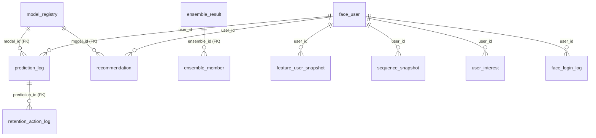

# 프로그램 구조도 · 함수/변수 명세서 v6

05-5(v5) 다음 버전. **5개월 정본(10피처·주별 시퀀스·라벨 2종) + models7(7모델) + 호환성 재구성(스키마 v2 / registry 기반 전처리 분기)** 확정 사항을 반영하고, **백엔드 서버(Node.js, 별도 스레드)** 를 토폴로지에 정식 편입한다. 글 포맷은 v5를 유지한다.

기준 문서: [05-5](05-5_프로그램_구조도_및_함수_변수_비전_명세서.md) · [17-6-1](17-6-1_백엔드_DB_변경사항.md) · [17-6-5](17-6-5_5m_models7_호환성정합_및_개선_계획서.md) · [19 백엔드 DB 계획서](19-0_백엔드_DB_MySQL_계획서.md) · `preprocessing_project/v2_5m/README.md`

**v6 주요 변경점**
- **백엔드 서버(Node.js) 정식 도입**: 기존 v5는 "Streamlit이 직접 Neon에 접속"이었으나, v6은 **Streamlit ↔ Node 백엔드 ↔ MySQL(운영) / Neon(시뮬 로그)** 3-tier로 분리. ML 추론은 모델파트가 별도로 수행하고 **결과값을 백엔드에 제출**한다.
- **운영 DB = MySQL**(모델 레지스트리·예측로그·피처 스냅샷·추천·리텐션), **시뮬레이션 로그 = Neon(Postgres)**. 대용량(1.27M 유저 피처·시퀀스)은 **DB 미적재 = 파일 + 경로**(불변).
- **스키마 v2 정합**: 10피처 canonical(`ndays`), 주별 고정길이 시퀀스 + 마스크, 라벨 2종(`churn`,`churn_no_purchase`). `model_registry`에 `preprocessing_config`/`dataset_path`/`metric_cv`/`metric_oot` 확장 → **registry 기반 전처리 분기**.
- **모델파트 → 백엔드 제출 인터페이스** 신설(`POST /models/submit`): 사전 전처리된 파일로 학습한 결과 변수(메트릭·전처리 config·artifact 경로·예측 배치)를 백엔드가 저장·관리.
- **신규 테이블** `user_interest`, `recommendation` 도입(추천 기능). **앙상블** 엔드포인트로 다모델 결합 개선점 표시.
- (여유 시) 결과를 **Neon으로 push** → 시뮬 사이트가 쿠폰/추천 표시(이탈예측→이탈방지 시연 루프 닫기).

---

## 0. 아키텍처 결정 원칙 (v5 계승 + v6 보강)

v5의 4원칙(Thin API / 실용 L2+ / DB-파일 경계 / 추론위치)은 유지한다. v6은 **"추론위치"** 를 다음과 같이 갱신한다.

| 축 | v5 | **v6 (변경/보강)** |
| --- | --- | --- |
| 백엔드 | 없음(Streamlit이 DB 직접) | **Node.js 백엔드 서버(별도 스레드)** 가 운영 DB·API 단일 진입점 |
| 운영 DB | Neon(Postgres) 단일 | **MySQL(운영) + Neon(시뮬 로그)** 2-DB. 백엔드가 Neon에서 로그 pull → MySQL에 예측 적재 |
| 추론 주체 | 로컬 Streamlit torch | **모델파트 담당**(사전 전처리 파일로 학습) → 결과를 `POST /models/submit`/`/predict`로 백엔드 제출. 백엔드는 **레지스트리·앙상블·로그**를 담당(무거운 torch 번들 X) |
| 전처리 분기 | 코드 하드코딩 | `model_registry.preprocessing_config` 기반 **registry 분기**(트리=raw / 선형=log+scaler / 시퀀스=raw+mask) |
| 대용량 | 파일+경로 | **불변**. 1.27M 유저 피처/시퀀스는 parquet/npz, DB엔 `artifact_path`만 |

**불변 규칙**(v5 계승): 스케일러/인코더/이벤트ID 매핑은 **train 구간에서만 fit**, 모든 런타임은 동일 artifact를 **transform만**. v6에서는 그 artifact(`prep_{Model}.joblib`)의 **경로·config가 `model_registry`에 등록**되어야 한다.

### 0.1 PR / 리뷰 체크리스트 (v6 추가분)
- [ ] 백엔드 API에 ML **추론 코드 없음**(추론은 모델파트, 백엔드는 저장·조합·서빙)
- [ ] MySQL엔 운영 데이터만(레지스트리·예측·피처스냅샷·추천·리텐션). 1.27M 원본·시퀀스는 파일+경로
- [ ] 모델 제출은 `model_registry`에 `preprocessing_config`+`artifact_path`+`metrics` 동반
- [ ] Neon 비밀·MySQL 비밀은 **백엔드 env에만**(Streamlit/브라우저 노출 0)
- [ ] 라벨 2종(`churn`,`churn_no_purchase`)·10피처(`ndays`) 스키마 v2 준수

---

## 1. 전체 아키텍처 구조도

프리뷰 Mermaid 비표시 문제로 **ASCII 구조도** 유지(+하단 Mermaid fold).

### 1.1 전체 데이터·학습·서빙 파이프라인 (v6)

```
[REES46 5개월 원본 zip (2,069만 이벤트)]
      |  preprocessing_project/v2_5m/src/prep_5month.py
      v
+--------------------------------------------------+
| [A] processed_5m 정본 (전체 1.27M 유저)          |
|   {train,test}_tabular.parquet  10피처+churn+np  |  (대용량=파일)
|   {train,test}_seq.npz          주별 [N,17/3,3]  |
+----------------+---------------------------------+
      | bayes_5m / finalize_5m_opt (코호트 recency<=7)
      v
+--------------------------------------------------+
| [B] 코호트·최적본  + ML_opt_scaler.joblib (저장)|
+----------------+---------------------------------+
      | models7_opt(개정 C') : prep_{Model}.joblib + models7_manifest.json
      v
+--------------------------------------------------+
| [C'] models7  (7모델 학습)  raw 단일정본 + 변환기|
|   메트릭/전처리config/artifact 경로 = 제출 대상  |
+----------------+---------------------------------+
      |  *** 모델파트 담당이 결과값을 백엔드에 제출 ***
      |  POST /models/submit  { model_name, type, preprocessing_config,
      |                         artifact_path, metrics_cv/oot, predictions[] }
      v
============================ 운영(서빙) ============================

 [Simulation Site] 유저활동 시뮬 --/events--> [Neon Postgres] sim_event_log
                                                      |
            (Node 백엔드가 Neon에서 로그 pull) <------+
                     |
                     v  최근 이벤트 -> 피처/시퀀스 스냅샷 -> 선택 모델들로 점수
            [Node.js 백엔드 서버 (별도 스레드)]
                 - model_registry 기준 active 모델 분기(전처리 config)
                 - 실시간 이탈율 + 원인분석 + 앙상블 개선점
                 - prediction_log / ensemble / recommendation 적재
                     |  (MySQL = 운영 단일원천)
                     v
            [MySQL]  model_registry / prediction_log /
                     feature_user_snapshot / sequence_snapshot /
                     user_interest / recommendation / retention_action_log
                     |
                     v  REST(JSON)
            [Streamlit 대시보드] 이탈확률·원인·추천·리텐션·앙상블 표시
                     |
                     v  (여유 시) 결과 push -> [Neon] -> 시뮬 사이트가 쿠폰/추천 노출
```

> 위가 **전체 흐름(전처리 → 제출 → 서빙 → 표시 → 방지 루프)**, 아래 1.2가 **배포 위치**다.

### 1.2 배포 토폴로지 (v6 확정안 B')

```
   [Simulation Site] 이커머스 유저활동 시뮬 (Next.js/정적 + 서버리스)
        |  유저 조회/장바구니/구매 -> 이벤트 발생 (/events)
        v  (HTTPS, SIM_API_SECRET)
   +===============================================+
   |  [Neon]  Postgres  (시뮬 로그 전용)           |
   |    sim_event_log  (REES46 스키마)             |
   |    (옵션) coupon_push / rec_push  <- 백엔드가 push
   +======================^========================+
        pull 로그 |        | push 결과(여유 시)
                  v        |
   +===============================================+
   |  [Node.js 백엔드 서버]  (별도 스레드, 상시)   |
   |   /models/submit /predict /predict/realtime   |
   |   /recommend /retention-action /ensemble      |
   |   Neon pull worker + MySQL 운영 저장          |
   +======================^========================+
         REST(JSON)        | (mysql2 pool)
                  v        v
   +===============================================+
   |  [MySQL]  운영 DB (단일원천)                  |
   |   model_registry / prediction_log /           |
   |   feature_user_snapshot / sequence_snapshot / |
   |   user_interest / recommendation /            |
   |   retention_action_log / face_user(+log)      |
   +===============================================+
        ^                       ^
        | REST                  | 파일 경로 참조(읽기)
        |                       |
   [Streamlit 대시보드]    [models/ 파일]  *.joblib *.pth *.parquet *.npz
     (얼굴로그인 + 고객/관리자)   (1.27M 피처/시퀀스 = DB 밖)
```

- **Node 백엔드** = 운영 DB·API 단일 진입점. Neon에서 로그 pull, 모델파트 제출 수신, MySQL 적재, Streamlit에 서빙.
- **Streamlit** = 표시·얼굴로그인 전용(추론·DB직결 제거 → 백엔드 REST 경유). torch 의존 제거 가능.
- **모델파트 담당** = 전처리된 파일로 학습 → **결과 변수만** 백엔드에 제출(무거운 연산은 백엔드 밖).

### 1.3 실시간(시뮬레이션) 예측 흐름 (v6)

```
[Simulation Site] 유저활동 시뮬 -> /events -> Neon.sim_event_log
        |
        v  (Node 백엔드 pull worker, 수 초 주기)
[Node 백엔드 /predict/realtime]
  1. Neon에서 최근 N개 이벤트 조회 (since cursor)
  2. 학습 동일 정렬/집계로 feature_user_snapshot + sequence_snapshot(파일 경로) 생성
  3. model_registry active 모델 N종 로드(preprocessing_config로 분기)
     - 모델 점수 자체는 모델파트 제출본 or 경량 룰/선형 재현으로 산출
  4. 실시간 이탈율 + 원인분석(top_factors) 계산 -> prediction_log
  5. 앙상블(가중평균/스태킹)로 개선점 -> ensemble_result
  6. (여유 시) recommendation/retention_action 생성 -> (옵션) Neon push
        |
        v
[Streamlit 대시보드] 백엔드 REST 조회 -> 실시간 이탈율·원인·앙상블·추천 표시
```

> "실시간"은 라이브 트래픽이 아니라 **시뮬 + Neon 폴링(수 초 지연)**. Node 백엔드가 켜져 있어야 예측이 돈다(별도 스레드 worker).

### 1.4 입력/출력 기준 (IO 계약)

| 구분 | 입력 | 처리 주체 | 출력 |
| --- | --- | --- | --- |
| 원본 전처리 | REES46 5개월 zip | 전처리 프로젝트(파일) | parquet/npz **파일** + meta JSON |
| 모델 학습 | 전처리 파일 | **모델파트 담당** | `prep_{Model}.joblib`, `*.pth/.cbm`, manifest |
| **모델 제출** | manifest+metrics+predictions | 모델파트 → **Node `POST /models/submit`** | `model_registry` 행 + (배치)`prediction_log` |
| 시뮬 이벤트 | 사이트 유저활동 | Simulation Site → Neon | `sim_event_log`(Neon) |
| 실시간 예측 | Neon 최근 이벤트 | **Node 백엔드** | `prediction_log`/`ensemble_result`(MySQL) |
| 추천 | `user_interest`+모델 | Node `/recommend` | `recommendation`(MySQL), (옵션)Neon push |
| 표시 | MySQL 운영데이터 | Streamlit ← Node REST | 대시보드 화면 |

**운영 원칙**: 팀 공유 단일원천 = **MySQL(운영)**. 시뮬 로그 = **Neon**. 1.27M 피처/시퀀스/모델바이너리 = **파일**(+DB 경로). DB는 작게.

---

## 2. 모델파트 → 백엔드 제출 인터페이스 (신규 ★)

각 모델파트 담당이 **사전 전처리된 파일로 학습**을 끝낸 뒤, 백엔드에 **결과값 변수**만 제출한다. 백엔드는 추론을 돌리지 않고 저장·관리·조합·서빙만 한다.

### 2.1 제출 계약 `POST /models/submit`

```jsonc
{
  "model_name": "CatBoost_ES_Feb",
  "model_type": "tree",                 // tree | linear | sequence | ensemble
  "feature_schema_version": "v2",       // 10피처 canonical(ndays)
  "preprocessing_config": {             // registry 기반 전처리 분기의 근거
    "scale": "none",                    // none(tree) | log1p+minmax(linear) | raw(seq)
    "scaler_path": null,                // 선형이면 prep_LogReg.joblib 경로
    "count_idx": ["ndays","n_events","n_view","n_cart","n_remove_from_cart","n_purchase","purch_amt"],
    "seq_granularity": null,            // 시퀀스면 "weekly", len, mask 여부
    "label": "churn"                    // churn | churn_no_purchase
  },
  "dataset_path": "sample_project/data/processed_5m/models7/CatBoost_train.parquet",
  "artifact_path": "models/tabular/catboost_es_feb.cbm",
  "metrics": { "auc_cv": 0.7902, "auc_oot": 0.7902, "pr_auc": 0.41, "recall": 0.66 },
  "train_period": "2019-10-01..2020-01-31",
  "is_active": true,
  "predictions": [                      // (선택) 배치 스코어 결과 동봉
    { "user_id":"...", "churn_probability":0.83, "risk_level":"high",
      "top_factors": {"recency_days":21,"n_purchase":0} }
  ]
}
```

- **artifact/dataset는 경로만**(파일은 DB 밖). `preprocessing_config`가 서빙 분기의 single source of truth.
- `predictions[]`는 옵션: 모델파트가 오프라인 배치로 점수를 미리 내면 그대로 `prediction_log`에 적재(실시간이 아닌 데모용).

### 2.2 제출 후 백엔드 동작
1. `model_registry`에 upsert(`is_active=true`면 동일 type 기존 active 해제).
2. `predictions[]` 있으면 `prediction_log` 배치 insert(+위험등급/원인 보존).
3. `/predict/realtime`·`/ensemble`이 이 레지스트리를 읽어 분기·조합.

---

## 3. 데이터 흐름 다이어그램 (Neon ↔ 백엔드 ↔ Streamlit)

```
            제출(모델파트)              REST(표시)
   models7 ──────────────▶ [Node 백엔드] ◀────────── [Streamlit 대시보드]
   prep.joblib/manifest        │  ▲                    얼굴로그인 + 고객/관리자
                               │  │
                      pull로그 │  │ push결과(여유 시)
                               ▼  │
                          [Neon Postgres]  sim_event_log
                               ▲
                        /events│
                   [Simulation Site] 유저활동 시뮬 -> 쿠폰/추천 노출(루프)
                               
   [Node 백엔드] ──운영저장/조회──▶ [MySQL]  registry/prediction/feature/
                                            sequence/user_interest/recommendation/
                                            retention/ face
```

- **방향성**: 모델파트→백엔드(제출), Neon→백엔드(pull), 백엔드→MySQL(저장), 백엔드→Streamlit(서빙), 백엔드→Neon(push, 옵션).
- Streamlit·Simulation Site는 **MySQL/Neon에 직접 접속하지 않고** 모두 백엔드(또는 시뮬 자체 API)를 경유 → 비밀 분리·계약 단일화.

---

## 4. MySQL 운영 ERD (v6)

`face_user.user_id`가 고객/관리자 식별 기준(논리참조). 강제 FK는 `prediction_log.model_id→model_registry`, `recommendation.model_id→model_registry`, `retention_action_log.prediction_id→prediction_log`, `ensemble_result`는 prediction 다대다를 `ensemble_member`로 연결.

```
                     +-------------------------------------------+
                     | model_registry                            |
                     | PK model_id                               |
                     |  model_name / model_type                  |
                     |  preprocessing_config(JSON)  <-- 분기근거 |
                     |  dataset_path / artifact_path  --> 파일   |
                     |  metric_cv / metric_oot / is_active       |
                     +----+--------------------+-----------------+
                          | 1                  | 1
                 model_id | (FK)      model_id | (FK)
                          v N                  v N
 +--------------+   +--------------------+   +----------------------+
 | face_user    |1 N| prediction_log     |   | recommendation       |
 | PK user_id   |--<| PK prediction_id   |   | PK rec_id            |
 |  display_name|   |  user_id(논리)     |   |  user_id / model_id  |
 |  role        |   |  model_id (FK)     |   |  rec_items_json      |
 +--+--+--+--+--+   |  churn_probability |   |  rec_categories_json |
    |  |  |  |      |  risk_level        |   +----------------------+
    |  |  |  |      |  top_factors_json  |
    |  |  |  |      +----+---------------+
    |  |  |  |           | 1 (FK prediction_id)
    |  |  |  |           v N
    |  |  |  |      +----------------------+      +----------------------+
    |  |  |  |      | retention_action_log |      | ensemble_result      |
    |  |  |  |      | PK action_id         |      | PK ensemble_id       |
    |  |  |  |      |  prediction_id (FK)  |      |  user_id             |
    |  |  |  |      |  action_type/message |      |  prob_ensemble       |
    |  |  |  |      |  status              |      |  improvement_json    |
    |  |  |  |      +----------------------+      +----+-----------------+
    |  |  |  |                                         | 1
    |  |  |  |                              ensemble_id| (FK)
    |  |  |  |                                         v N
    |N |N |N |N (user_id 논리참조 1:N)                +----------------------+
 +--------------+ +-----------------+ +-------------+ | ensemble_member      |
 |face_login_log| |feature_user_snap| |user_interest| |  PK member_id        |
 |PK login_id   | |PK snapshot_id   | |PK user_id   | |  ensemble_id (FK)    |
 |  user_id     | |  churn/churn_np | |  top_cat    | |  model_id            |
 |  success/sim | |  cohort_flag    | |  top_brand  | |  weight / prob       |
 +--------------+ |  feature_json   | |  interest   | +----------------------+
                  +-----------------+ +-------------+
 +----------------------+
 | sequence_snapshot    |   artifact_path --> 파일(npz, DB 밖)
 | PK snapshot_id       |   dataset_tag / seq_len / n_features / label
 +----------------------+
```

**관계 요약**

| 부모(1) | 자식(N) | 키 | FK |
| --- | --- | --- | --- |
| `model_registry` | `prediction_log` | model_id | **FK** |
| `model_registry` | `recommendation` | model_id | **FK** |
| `model_registry` | `ensemble_member` | model_id | 논리 |
| `prediction_log` | `retention_action_log` | prediction_id | **FK** |
| `ensemble_result` | `ensemble_member` | ensemble_id | **FK** |
| `face_user` | `prediction_log`/`recommendation`/`feature_user_snapshot`/`sequence_snapshot`/`user_interest`/`face_login_log` | user_id | 논리 |

> 파일 참조: `model_registry.artifact_path`/`dataset_path`, `sequence_snapshot.artifact_path`는 DB 밖 파일(joblib/pth/parquet/npz). DDL은 [19 계획서](19-0_백엔드_DB_MySQL_계획서.md) §3 및 `backend/db/schema_mysql.sql`.

<details><summary>Mermaid ERD (지원 뷰어용)</summary>


</details>

---

## 5. 스키마 v2 정합 (17-6-5 반영)

| 항목 | v1 배포본 | **v2 정합(본 문서 기준)** |
| --- | --- | --- |
| 정형 피처 | 7(`active_days`) | **10 canonical**(`recency_days,tenure_days,ndays,n_events,n_view,n_cart,n_remove_from_cart,n_purchase,avg_price,purch_amt`) |
| 활동일수 | `active_days` | `ndays` (매핑표로 v1 폴백) |
| 시퀀스 | 일별 [N,14,3] | **주별 고정길이 + 패딩 마스크**(17/4 비대칭 제거) |
| 라벨 | churn | **churn + churn_no_purchase** |
| 전처리기 | seq_scaler✅ | **prep_{Model}.joblib + manifest**(registry 등록) |
| registry | 미확장 | **preprocessing_config/dataset_path/metric_cv/oot/model_type** |

서빙 분기 규칙(registry 기반): **tree=raw** / **linear=log1p+minmax(scaler 로드)** / **sequence=raw+mask**. 분기 근거는 `model_registry.preprocessing_config`.

---

## 6. 폴더 · 모듈 책임 (v6 신규 backend/)

기존 `sample_project/`·`preprocessing_project/`는 **건드리지 않음**. 신규는 `backend/`에만.

> **구조 원칙(수정)**: 기존 폴더 방식 유지 + **필요한 파일만**. 다층 트리(controllers/repositories/middleware/utils) **사용 안 함** — 단일 `backend/` 폴더 평면 구성.

```
team_project_churn/
├── preprocessing_project/        (읽기) 전처리 버전관리
├── sample_project/               (읽기) 현 Streamlit·전처리 산출물·DB
└── backend/                      ★ 신규 — Node.js 운영 백엔드 (평면, 8파일)
    ├── server.js                 HTTP 서버 + 전 엔드포인트 + 도메인로직(추론 X)
    ├── db.js                     MySQL(운영)·Neon(시뮬) 연결 (미설정 시 메모리 모드)
    ├── check.js                  무설치 스모크
    ├── schema_mysql.sql          운영 MySQL DDL
    ├── seed.sql                  데모 시드
    ├── package.json / .env.example
    └── CONTRACT.md / README.md   모델→서버 공유변수 계약 / 사용법
```
- **화면(웹)은 Streamlit**(대시보드 + 시뮬 결과), 백엔드는 REST API만. 운영 권고 서버=Fastify(스켈레톤은 무설치 내장 http).

| 모듈(파일) | 입력 | 출력 | 책임 |
| --- | --- | --- | --- |
| `server.js`(routes) | HTTP | JSON | 라우팅·검증·도메인 로직(추론 X) |
| `server.js`(ensemble/recommend/retention) | 확률·관심·이벤트 | 조합 결과 | 가중평균·추천·리텐션 |
| `db.js`(registerModel/listModels) | 제출 payload | registry 행 | 등록·active 분기 |
| `db.js`(pullSimEvents/pushRetention) | Neon | sim 이벤트/푸시 | 시뮬 로그 pull·결과 push |

---

## 7. 함수/변수 명세 (백엔드 핵심)

| 함수 | 시그니처(개념) | 설명 |
| --- | --- | --- |
| `modelService.submit(dto)` | dto → {model_id} | registry upsert + (옵션)배치 prediction 적재 |
| `modelService.listActive(type)` | type → rows | 분기용 active 모델 조회 |
| `predictService.realtime(opts)` | {limit,models} → rows | Neon pull→스냅샷→분기점수→prediction_log |
| `predictService.scoreOne(snap,model)` | (snap,model) → prob | preprocessing_config로 transform 후 점수 |
| `ensembleService.combine(probs,weights)` | → {prob,improvement} | 가중평균/스태킹 + 개선점 |
| `recommendService.forUser(uid)` | uid → items | user_interest×모델, view1/cart3/purchase5 |
| `retentionService.suggest(pred)` | pred → action | risk별 쿠폰/리마인드 |
| `neonPull.poll(cursor)` | cursor → events | sim_event_log since cursor |

| 변수(env/상수) | 기본 | 의미 |
| --- | ---: | --- |
| `PORT` | 8080 | 백엔드 리슨 |
| `MYSQL_URL` | — | 운영 DB(풀) |
| `NEON_URL` | — | 시뮬 로그(SSL·풀) |
| `API_KEY` | — | 내부 인증 헤더 |
| `RISK_LOW/HIGH` | 0.35/0.65 | 위험등급 임계값(17-6-5) |
| `PULL_INTERVAL_MS` | 5000 | Neon pull 주기 |
| `ENSEMBLE_WEIGHTS` | auto | 모델 가중(미지정=AUC 비례) |
| `FEATURE_SCHEMA_VERSION` | v2 | 10피처 canonical |

---

## 8. 실시간 IO 계약(요약) · 배포

API 상세는 [19 계획서](19-0_백엔드_DB_MySQL_계획서.md) §4. 배포: 백엔드(Node)는 상시 실행(별도 스레드/프로세스), MySQL은 로컬/관리형, Neon은 시뮬 로그 전용, Streamlit은 백엔드 REST만 호출.

```
1. MySQL 생성 -> backend/db/schema_mysql.sql 적용
2. 전처리 파일 준비(processed_5m, prep_{Model}.joblib) — 모델파트
3. 모델파트가 POST /models/submit 으로 결과 제출 -> model_registry
4. Simulation Site -> Neon.sim_event_log 적재
5. Node 백엔드 pull worker가 Neon 폴링 -> /predict/realtime -> prediction_log
6. /ensemble 로 앙상블 개선점, /recommend·/retention-action 으로 방지 액션
7. Streamlit 대시보드가 백엔드 REST로 표시. (여유 시) 결과 Neon push -> 사이트 쿠폰
```

---

## 9. 주의사항 (v6)
- **백엔드에 torch/추론 코드 금지**. 추론은 모델파트가 파일로 수행→제출. 백엔드는 저장·조합·서빙.
- MySQL = 운영, Neon = 시뮬 로그. **둘 다 비밀은 백엔드 env에만**. Streamlit/사이트는 직접 접속 금지.
- 1.27M 유저 피처·시퀀스·모델바이너리는 **파일+경로**(MySQL 미적재). Neon free 한도 보호 동일.
- 스키마 v2(10피처·라벨2종·주별 시퀀스) 준수, registry 기반 전처리 분기.
- 기존 `sample_project`/`preprocessing_project` 산출물은 **읽기만**. 신규는 `backend/`에만(추가형·무중단).
- "실시간"은 시뮬+Neon 폴링(수 초 지연). 백엔드 상시 실행 전제.
</content>
</invoke>
