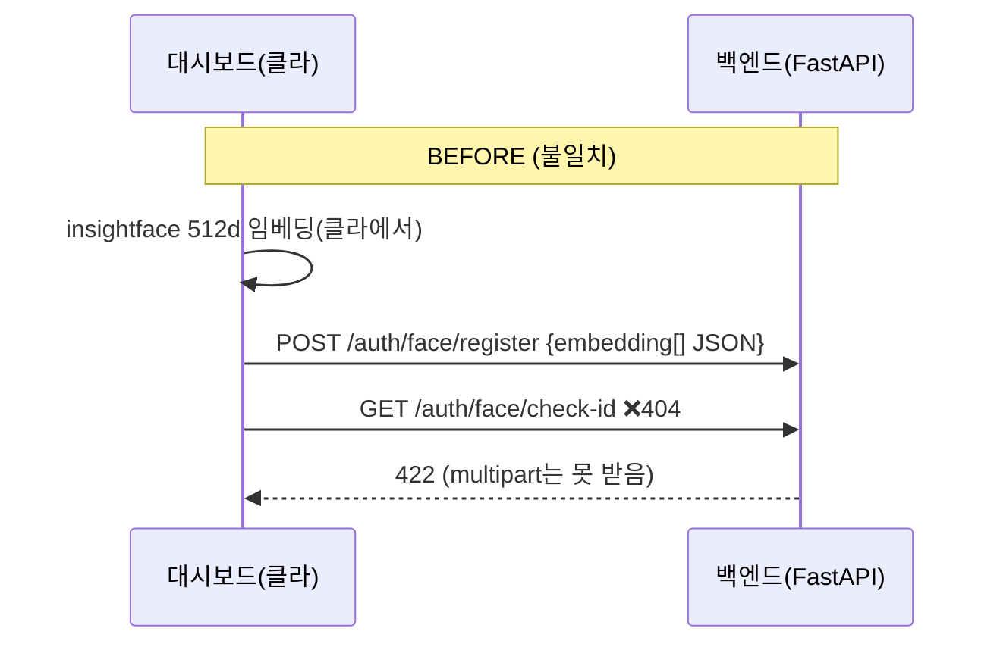
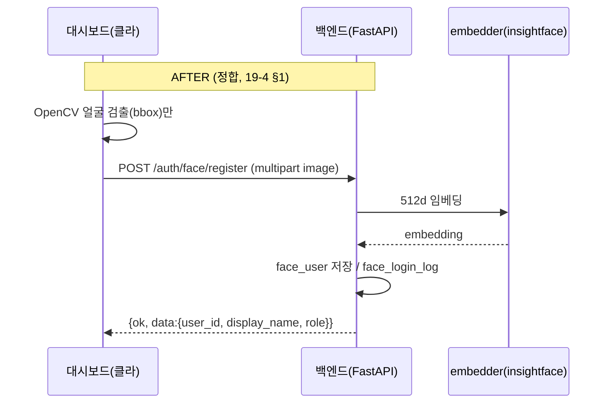

# BUG-001 — 얼굴 인증 프론트↔백엔드 계약 불일치 (대시보드 로그인 연동 실패)

| 항목 | 값 |
| --- | --- |
| **ID** | BUG-001 |
| **제목** | dashboard_streamlit 얼굴 로그인이 백엔드와 연동 안 됨 (`/auth/face/*` 계약 불일치) |
| **심각도** | High (로그인 전면 차단 → 대시보드 진입 불가) |
| **상태** | ✅ Resolved (2026-06-22) |
| **영역** | backend `interfaces/http/auth_router`, `application/auth_usecase` · 계약문서 19-4 |
| **보고일** | 2026-06-22 (사용자 "프론트 대시보드랑 백엔드 연동이 안 되는 것 같다") |
| **유입 시점** | 2026-06-21(26-11) 백엔드 auth 구현 ↔ 2026-06-22 프론트 재작성 사이의 계약 분기 |
| **관련 문서** | [19-4](19-4_대시보드팀_파일구조_및_API_계약서.md) §5·§7.1, [26-11](26-11_가지마_폴더구조_정렬_및_대시보드_이동.md) |

---

## 1. 요약 (TL;DR)
대시보드(프론트)는 **얼굴 이미지를 multipart로 업로드**하고 백엔드가 임베딩하길 기대 + `/auth/face/check-id`를 호출했는데, 백엔드는 **클라이언트가 만든 512d 임베딩을 JSON으로 받도록** 구현돼 있었고 `check-id`가 없었다. 그 결과 로그인/등록 전 경로가 **404/422**로 실패. 백엔드를 이미지 기반(백엔드 임베딩)으로 정합하고 `check-id`를 추가, 19-4 계약을 정정해 해결.

## 2. 증상 (What)
- 회원가입/로그인 시도 시 동작 안 함. 실제 요청 결과:
  - `GET /auth/face/check-id` → **404 Not Found** (백엔드에 라우트 없음)
  - `POST /auth/face/register` (multipart image) → **422** (백엔드가 JSON body·`embedding` 필드 기대)
  - `POST /auth/face/login` (multipart image) → **422**

## 3. 발생 위치 (Where)
- 프론트(기대 계약): `dashboard_streamlit/services/auth_service.py`
  - `check_user_id_available` → `GET /auth/face/check-id`
  - `register_face` / `login_face` → `multipart`(`files={image}`, `data={user_id, display_name, role, face_bbox}`)
  - 화면 `pages/01_face_login.py`: "OpenCV 검출 → 백엔드에서 512d 임베딩" 명시
- 백엔드(실제, 정정 전): `backend/app/interfaces/http/auth_router.py`, `backend/app/schemas/auth_schema.py`
  - `FaceRegisterIn{user_id, display_name, role, embedding[]}` / `FaceLoginIn{embedding[], user_id}` (JSON)
  - `check-id` 라우트 없음

## 4. 근본 원인 (Why)
- **계약의 임베딩 주체 미명시.** 19-4 §7.1이 "백엔드가 face_user/face_login_log 처리"만 적고 **임베딩을 누가 하는지(클라 vs 백엔드)** 를 명시하지 않음.
- 그 결과 26-11 백엔드 구현은 "클라가 insightface 임베딩 → JSON 전송"으로, 이후 프론트 재작성은 "클라 OpenCV 검출 → 이미지 업로드 → 백엔드 임베딩"으로 **서로 다르게 해석**.
- 19-4 §1 원칙("대시보드=표시 계층, 무거운 ML=백엔드")에 비춰 **프론트 해석이 옳고 백엔드가 어긋남**.

## 5. 영향 (Impact)
- 대시보드 얼굴 등록/로그인 100% 실패 → 로그인 게이트 통과 불가 → 대시보드 사용 불가.
- 교육과제①(로그인 로그)·②(중복ID) 시연 불가.

## 6. 진단 방법 (How detected)
1. `.env` 확인 → `DASHBOARD_API_BASE_URL=http://127.0.0.1:8090`, `DASHBOARD_API_KEY=anchor-dev-key`, `USE_MOCK=false` (설정 정상).
2. 백엔드 기동 확인 → `8090 LISTENING` (미기동 아님).
3. 프론트 `auth_service.py` 호출 ↔ 백엔드 `auth_router.py` 시그니처 대조 → 엔드포인트(check-id 부재)·페이로드(multipart vs JSON) 불일치 확정.

## 7. 해결 (How / Method / When)
**방법: 백엔드를 프론트(이미지 기반) 계약에 맞춤 + 19-4 정정.** 적용일 2026-06-22.

### 7.1 구조 변경 (Before → After)





핵심 이동: **임베딩 책임이 대시보드 → 백엔드**로 이동(19-4 §1 부합). 대시보드는 "검출+업로드"만.

### 7.2 코드 수정
| 파일 | 변경 |
| --- | --- |
| `backend/app/infrastructure/face/embedder.py` | **신규** — insightface(buffalo_l) lazy 로드, `embed_from_image_bytes(bytes)->list[float]`. 모델/얼굴 없으면 None(graceful) |
| `backend/app/application/auth_usecase.py` | **추가** `check_id()`, `register_face_image()`, `login_face_image()` (이미지→백엔드 임베딩). 구 JSON 버전은 하위호환 유지 |
| `backend/app/interfaces/http/auth_router.py` | register/login을 **`UploadFile`+`Form`(multipart)** 로 변경, `GET /auth/face/check-id` 추가 |
| 의존성 | `python-multipart` 설치(FastAPI 멀티파트 필수) |
| `reports/19-4_*.md` | §5에 check-id 추가·register/login multipart 명시, §7.1 흐름도에 "백엔드 임베딩" 반영 |

대표 diff(개념):
```python
# BEFORE  auth_router.py
@router.post("/auth/face/register")
async def face_register(body: FaceRegisterIn):          # JSON {embedding[]}
    return ok(unwrap(uc.register_face(body.user_id, body.display_name, body.role, body.embedding)))
# (check-id 없음)

# AFTER  auth_router.py
@router.get("/auth/face/check-id")
async def check_id(user_id: str = Query(...)):
    return ok(unwrap(uc.check_id(user_id)))

@router.post("/auth/face/register")
async def face_register(user_id: str = Form(...), display_name: str = Form(""),
                        role: str = Form("customer"), face_bbox: str = Form(None),
                        image: UploadFile = File(...)):                  # multipart 이미지
    return ok(unwrap(uc.register_face_image(user_id, display_name, role, await image.read())))
```

## 8. 검증 (Verification, 2026-06-22 · 실 MySQL project2db)
| 케이스 | 결과 |
| --- | --- |
| `GET /auth/face/check-id?user_id=newuser_x` | **200** `{exists:false, available:true}` |
| `POST /auth/face/register` (얼굴 없는 더미 이미지) | **422** "얼굴 임베딩 실패(얼굴 미검출…)" — 멀티파트 수용+임베더 동작 확인 |
| `POST /auth/face/register` (**실제 얼굴** insightface 샘플) | **200** `has_face:true` |
| `POST /auth/face/login` (동일 얼굴) | **200** 매칭 `user_id=real_face_1`, **similarity 1.0** |
| 중복 등록 | **409** "이미 등록된 사용자 ID" (교육과제②) |
| 백엔드 import / 12 routes | ✅ |

## 9. 재발 방지 (Prevention)
- **19-4 계약 정정**(임베딩 주체=백엔드, multipart, check-id 명시) → 단일 출처화.
- 계약 변경 시 **양측(프론트 호출 ↔ 백엔드 시그니처) 대조를 PR 체크리스트**에 추가 권장.
- 향후 `pytest`에 `/auth/face/*` 계약 스모크(멀티파트 수용·check-id 200) 추가 권장.
- 본 사건을 표준 삼아 **버그리포트 작성 룰**을 RULE.md에 추가(아래).

## 10. 잔여
- 대시보드 데이터 패널(`02_dashboard.py`)은 현재 placeholder("API 연결 대기") → `/dashboard/*`·`/predictions/*` 와이어링은 별건(프론트 미구현).
- insightface 모델(buffalo_l)은 백엔드 호스트에 캐시 필요(최초 ~300MB). 현재 로컬 캐시 확인됨.
